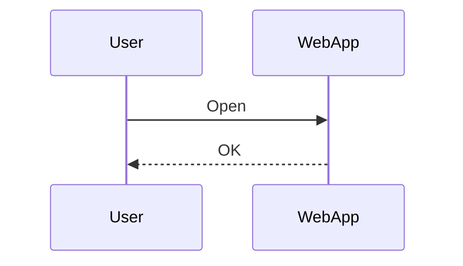
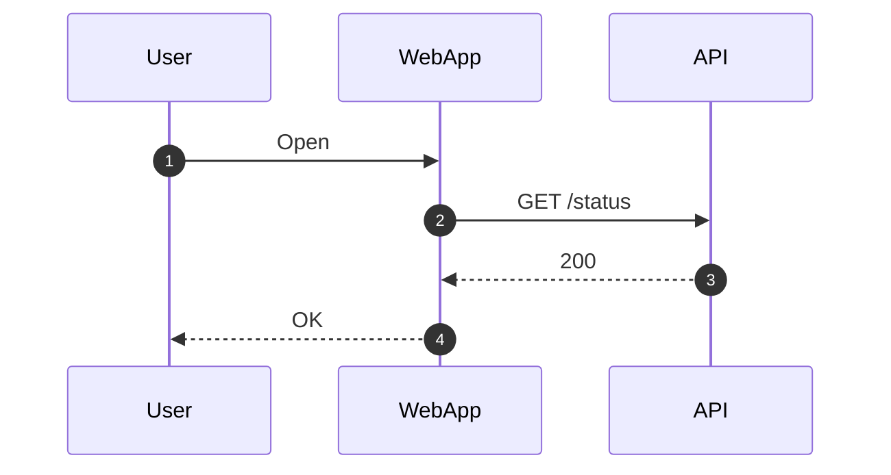
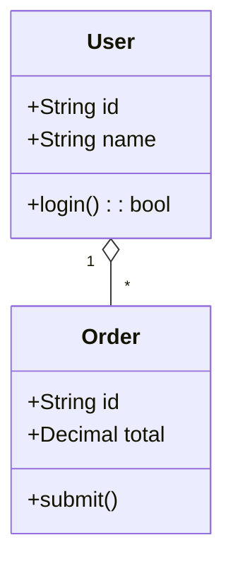
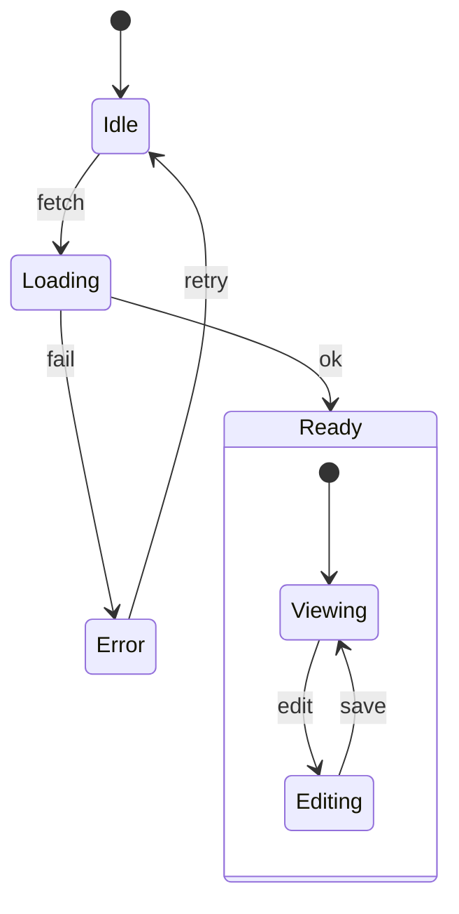
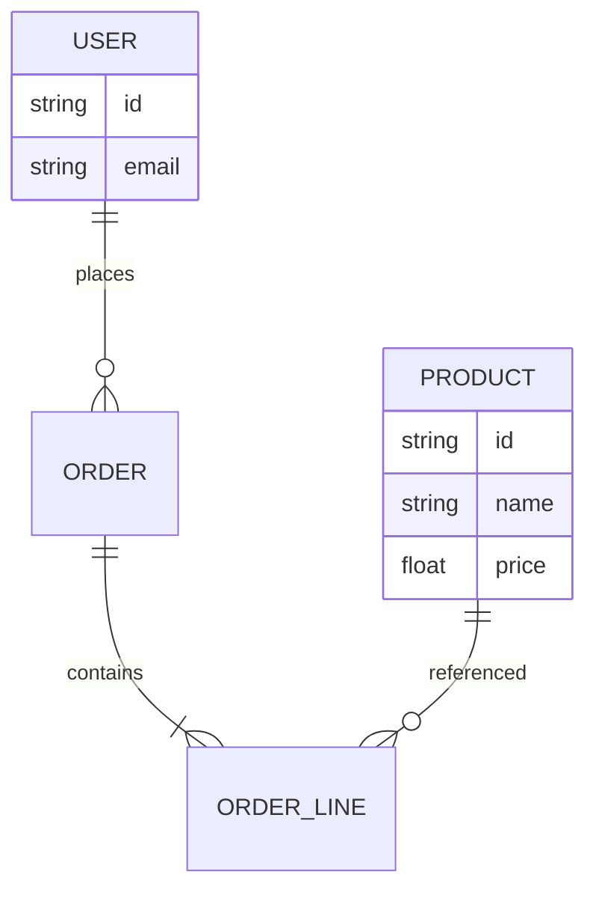
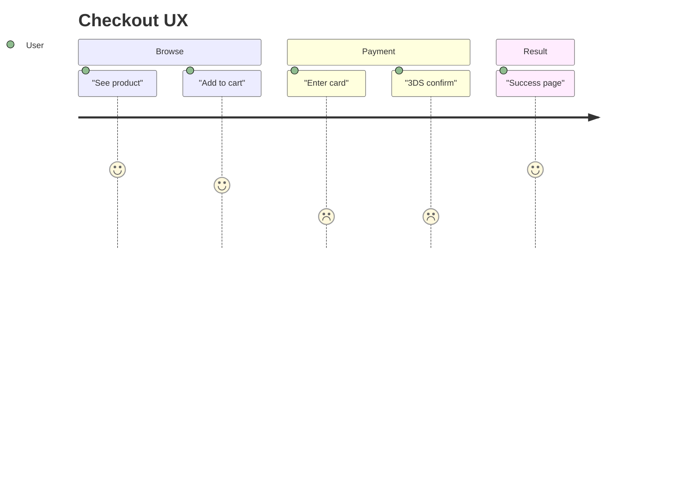
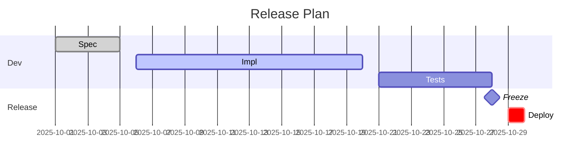
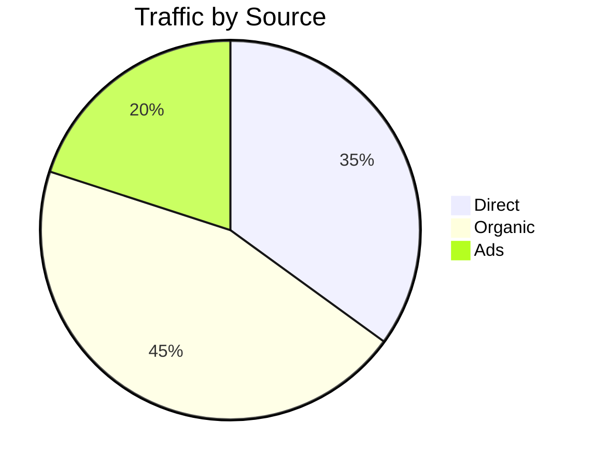

# Mermaid Diagrams Skill

This skill provides:
- Conservative Mermaid templates that render on older renderers (VS Code/Markdown previewers, Git platforms) and remain clear to humans
- Guidance on which diagram type to use for specific situations
- Compatibility tips and fallbacks when advanced Mermaid types are unavailable
- Human-readable ASCII/Unicode sidecars for each diagram

## Compatibility Rules

Apply these rules when creating Mermaid diagrams:

- Prefer `graph LR`/`graph TB` for flowcharts; some renderers fail on `flowchart` keyword
- Quote labels containing spaces/special characters: `A["Text (x|y) |"]`
- **Do not use literal `\n` inside labels** – Mermaid does not interpret these line breaks. Use `<br/>` for line breaks instead
- Advanced types like `quadrantChart`, `sankey-beta`, `requirementDiagram`, `gitGraph` may not be available. Use provided flowchart fallbacks
- Code fences must start at column 0 with language `mermaid`

## ASCII/Unicode Sidecar (Human-Readable Raw Markdown)

Always include an ASCII/Unicode sidecar immediately below each Mermaid block to optimize for quick human scanning in raw Markdown and robust parsing by agents.

**Requirements:**
- Include a monospace, text-only diagram right under the Mermaid block using fenced code with language `text`
- Keep Mermaid and sidecar in sync (same nodes/edges, same labels where feasible). If they diverge, treat Mermaid as the source of truth and update the sidecar
- Limit width to ~80 columns for readability in diffs and terminals
- Use simple line art characters (ASCII first; Unicode box-drawing optional when environment supports it)
- Add a one-line caption above the pair: `Diagram: <name> (<type>)`

**Recommended primitives:**
- Boxes: `[Name]`, `(Name)`, `+-----+\n| N |\n+-----+`
- Flows: `-->`, decisions as `{cond?}` lines, lists with `•` or `-`
- Sequence (text-based): `Actor -> Actor: message` with indented lifelines

Example (Flowchart):
```mermaid
graph LR
  A["Start"] --> B{Auth?}
  B -->|Yes| C["Dashboard"]
  B -->|No|  D["Login"]
```
```text
Diagram: Auth flow (flowchart)
  [Start] --> {Auth?}
      {Auth?} -- Yes --> [Dashboard]
      {Auth?} -- No  --> [Login]
```

Example (Text-based Sequence):

```text
Diagram: Happy path (sequence)
  User -> WebApp : Open
  WebApp -> User : OK
```

## Working Templates (Renderer-Compatible)

### Flowchart
```mermaid
graph LR
  A["Start"] --> B{Auth?}
  B -->|Yes| C["Dashboard"]
  B -->|No|  D["Login"]
  C --> E["Settings"]
```

### Sequence


### Class


### State (v2)


### ER (Entity-Relationship)


### Journey (User Journey)


### Gantt


### Pie (compatible syntax)


## When to Use Which Diagram

Choose the appropriate diagram type based on the content:

- **Flowchart**: General flows, decisions, and data movement in specs and PRDs
- **Sequence**: Interactions over time between actors/services (APIs, requests, responses)
- **Class**: Domain models and static structure; useful for entity attributes and relations
- **State**: Lifecycle of an entity/component (idle → loading → ready/error, nested states)
- **ER**: Database/logical data model with cardinalities
- **Journey**: User experience across steps/sections (great for PRD acceptance flows)
- **Gantt**: Scheduling, releases, and dependencies by dates
- **Pie**: Simple composition/ratios; prefer tables when precision matters

## Additional Resources

### Reference Files

For advanced diagram types and troubleshooting, consult:
- **`references/fallbacks-and-troubleshooting.md`** - Fallback templates for unsupported diagram types (quadrant, requirement, sankey, gitGraph), troubleshooting guidance, complex examples, and best practices

Use fallback templates when advanced Mermaid types are unavailable in the target renderer.
