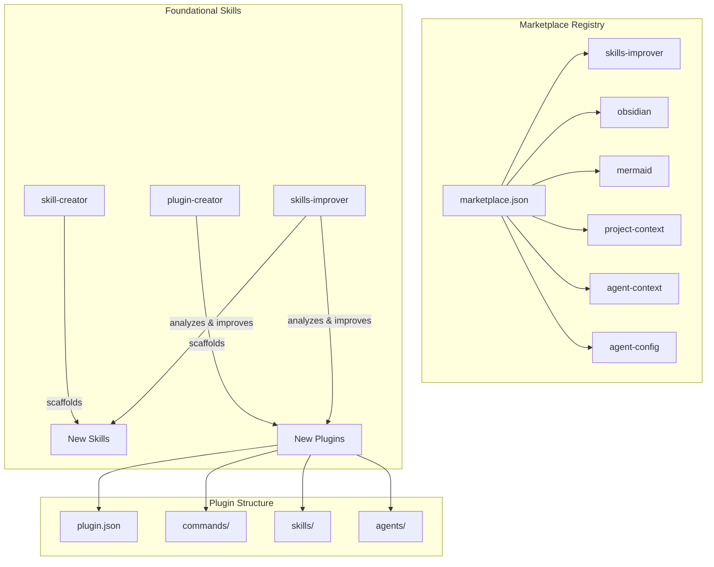

# Architecture

## Tech Stack
- **Runtime:** Claude Code CLI (plugin system)
- **Languages:** Markdown (skills/commands), Python (validation/analysis scripts), JSON (plugin manifests)
- **CI/CD:** GitHub Actions (`claude.yml` for interactive execution, `claude-code-review.yml` for PR reviews)
- **Distribution:** `.claude-plugin/marketplace.json` registry

## System Overview

**Flow:** Users install plugins from the marketplace. Foundational skills help create new plugins or improve existing ones. The skills-improver analyzes conversation history to propose targeted improvements.

## Key Decisions
| Decision | Rationale | Date |
|----------|-----------|------|
| Skill-centric architecture | Skills are self-contained with SKILL.md + scripts/ + references/ for context-aware loading | 2025 |
| Python scripts for validation | No build pipeline needed; scripts validate SKILL.md structure directly | 2025 |
| Self-improving ecosystem | Skills can enhance other skills via the skills-improver workflow | 2025 |
| Marketplace via JSON registry | Simple distribution without a server; plugins installed by reference | 2025 |

---
*Last updated: 2026-03-15*
