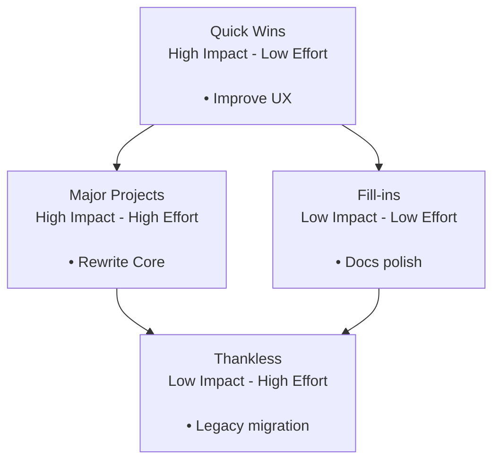
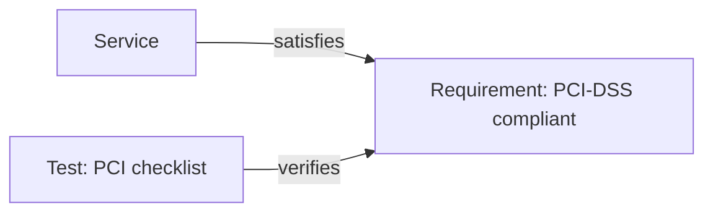
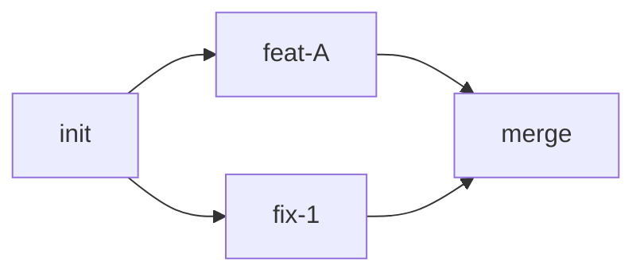
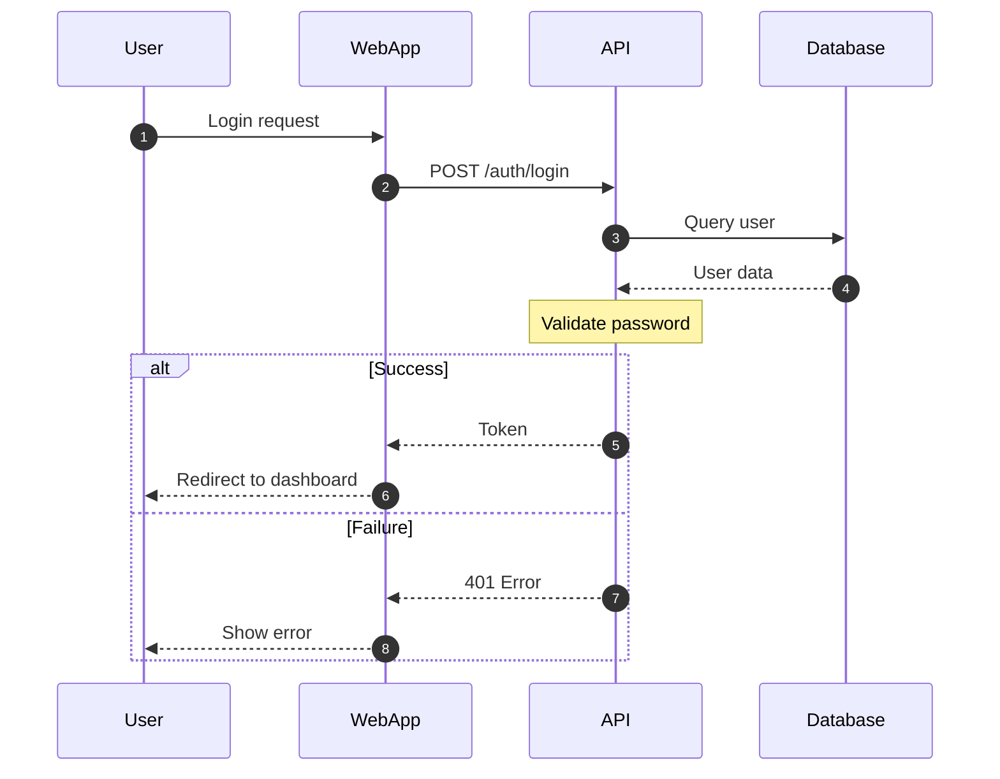
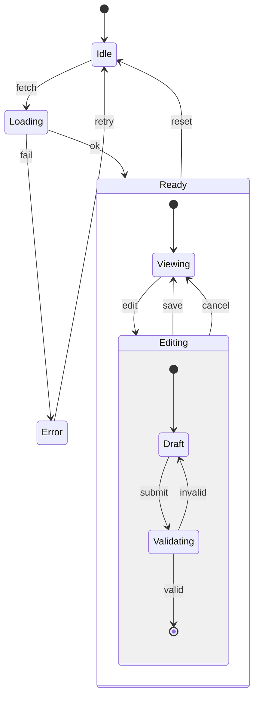

# Mermaid Fallback Templates and Troubleshooting

This file contains fallback templates for advanced Mermaid diagram types that may not be supported in older renderers, plus troubleshooting guidance.

## Fallback Templates

When advanced Mermaid diagram types (quadrantChart, sankey-beta, requirementDiagram, gitGraph) are unavailable, use these flowchart-based fallbacks.

### Quadrant Chart Fallback

Use a flowchart with boxes representing quadrants for prioritization matrices:



```text
Diagram: Priority Matrix (quadrant fallback)
  [Quick Wins]        [Major Projects]
   (High/Low)          (High/High)
       |                    |
  [Fill-ins]   <---> [Thankless]
   (Low/Low)          (Low/High)
```

**When to use:** Prioritization matrices showing Impact vs. Effort, Urgency vs. Importance, or similar 2x2 grids.

### Requirement Diagram Fallback

Use a flowchart to show traceability between requirements, tests, and system elements:



```text
Diagram: Requirements traceability (requirement fallback)
  [Service] -- satisfies --> [Requirement: PCI-DSS]
  [Test: PCI checklist] -- verifies --> [Requirement: PCI-DSS]
```

**When to use:** Requirements engineering, traceability matrices, compliance documentation.

### Sankey Diagram Fallback

Use a flowchart with edge labels showing weights/volumes:

```mermaid
graph LR
  Checkout["Checkout"] -->|100| PSP["PSP"]
  PSP -->|60|  Settled["Settled"]
  PSP -->|40|  Declined["Declined"]
```

```text
Diagram: Payment flow volumes (sankey fallback)
  [Checkout] --100--> [PSP]
      [PSP] --60--> [Settled]
      [PSP] --40--> [Declined]
```

**When to use:** Flow diagrams where volume/quantity matters (payment flows, traffic distribution, resource allocation).

### Git Graph Fallback

Use a flowchart to represent simple branch/merge DAGs:



```text
Diagram: Git history (gitGraph fallback)
  [init] --> [feat-A] --> [merge]
    |                      ^
    +---> [fix-1] ---------+
```

**When to use:** Git history visualization, simple branch/merge flows (for complex history, use native gitGraph if available).

## Troubleshooting

### Diagram Fails to Render

If a Mermaid diagram fails to render, apply these fixes in order:

1. **Replace `flowchart` with `graph`**
   - Some renderers don't support the newer `flowchart` keyword
   - Change `flowchart LR` to `graph LR`
   - Simplify shapes to basic rectangles and diamonds

2. **Quote node texts**
   - Add quotes around labels: `A["Label text"]` instead of `A[Label text]`
   - Especially important for labels with spaces, special characters, or pipes

3. **Test in Mermaid Live Editor**
   - Visit `https://mermaid.live`
   - Paste the diagram code
   - If it works there but not in your environment, the issue is renderer-specific
   - Check your renderer version and update if possible

4. **Fall back to conservative templates**
   - Use the working templates from SKILL.md
   - Avoid experimental diagram types
   - Use fallback templates from this file for advanced types

### Common Syntax Errors

**Line breaks in labels:**
- Don't use `\n` in labels (not interpreted)
- Use `<br/>` instead: `A["Line 1<br/>Line 2"]`

**Special characters:**
- Quote labels with parentheses, pipes, brackets: `A["Cost (USD) | Total"]`
- Escape quotes inside quoted labels: `A["He said \"hello\""]`

**Code fence position:**
- Code fence must start at column 0
- No leading spaces before ` ```mermaid `

**Arrow syntax:**
- Use `-->` for directed edges, `---` for undirected
- Use `-- label -->` for labeled edges
- Don't mix arrow styles inconsistently

### Renderer-Specific Issues

**GitHub/GitLab:**
- Generally support basic diagram types (flowchart, sequence, class, state, ER)
- May not support newer types (quadrant, sankey, requirement, gitGraph)
- Use fallback templates for unsupported types

**VS Code Preview:**
- Depends on Markdown preview extension
- Update extension for better Mermaid support
- Consider using Mermaid Preview extension for testing

**Obsidian:**
- Native Mermaid support is good
- Most diagram types work
- Check plugin settings if diagrams don't render

**Confluence/Notion:**
- May require plugins or specific syntax
- Test in their preview mode
- Consider exporting diagrams as images for compatibility

## Additional Examples

### Complex Sequence Diagram with Notes



```text
Diagram: Login flow with error handling (sequence)
  User -> WebApp : Login request
  WebApp -> API : POST /auth/login
  API -> DB : Query user
  DB -> API : User data
  [API validates password]
  Success path:
    API -> WebApp : Token
    WebApp -> User : Redirect
  Failure path:
    API -> WebApp : 401 Error
    WebApp -> User : Show error
```

### Nested State Diagram



```text
Diagram: Editor state machine (state)
  [Idle] --fetch--> [Loading]
  [Loading] --ok--> [Ready]
  [Loading] --fail--> [Error]

  [Ready] contains:
    [Viewing] <--edit/save--> [Editing]

    [Editing] contains:
      [Draft] --submit--> [Validating]
      [Validating] --invalid--> [Draft]
      [Validating] --valid--> (exit)

  [Error] --retry--> [Idle]
  [Ready] --reset--> [Idle]
```

## Best Practices Summary

**For maximum compatibility:**
- Use `graph` instead of `flowchart`
- Quote all labels with spaces or special characters
- Test in Mermaid Live Editor first
- Provide ASCII sidecars for human readability
- Use fallback templates for advanced types
- Keep diagrams simple and focused
- Prefer multiple simple diagrams over one complex diagram

**For professional documentation:**
- Add descriptive titles to diagrams
- Use consistent styling and naming
- Include legends when using custom symbols
- Provide context in surrounding text
- Keep ASCII sidecars in sync with Mermaid
- Use semantic colors when available (red for errors, green for success)
