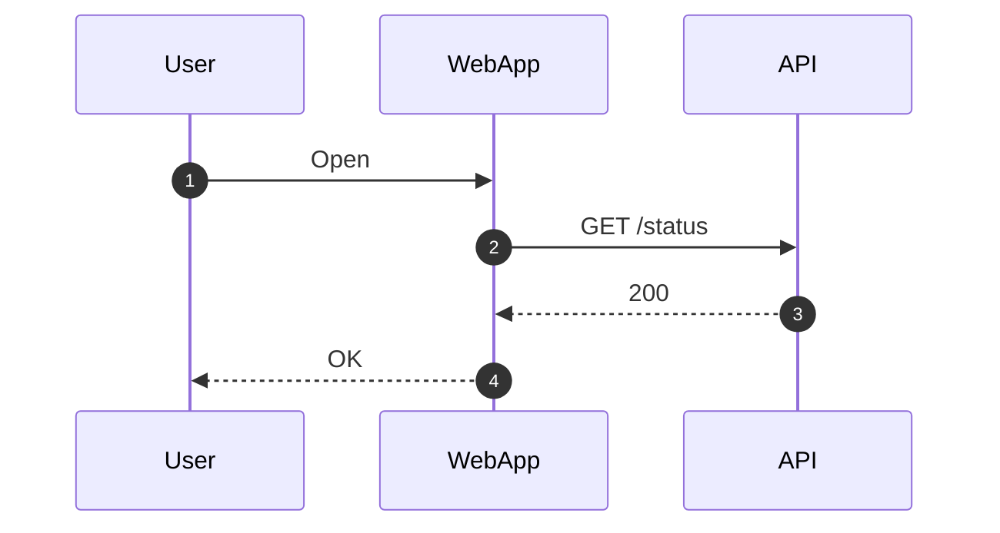
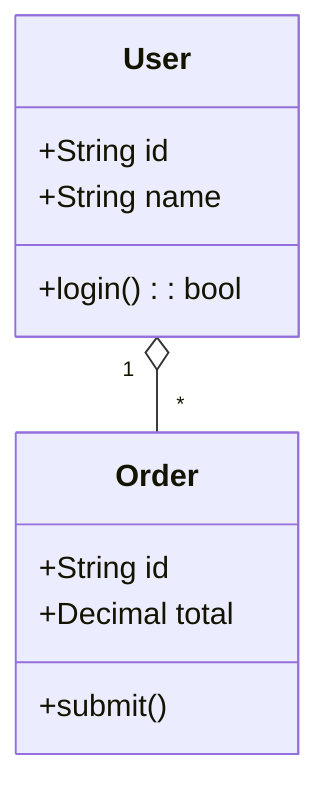
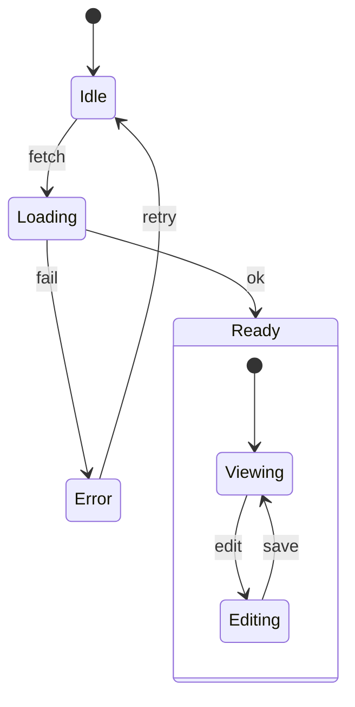
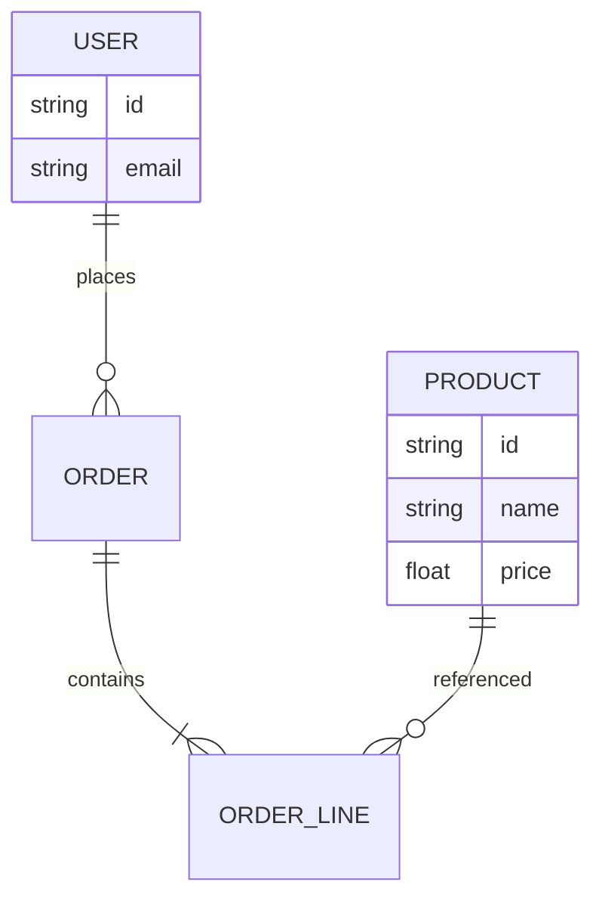
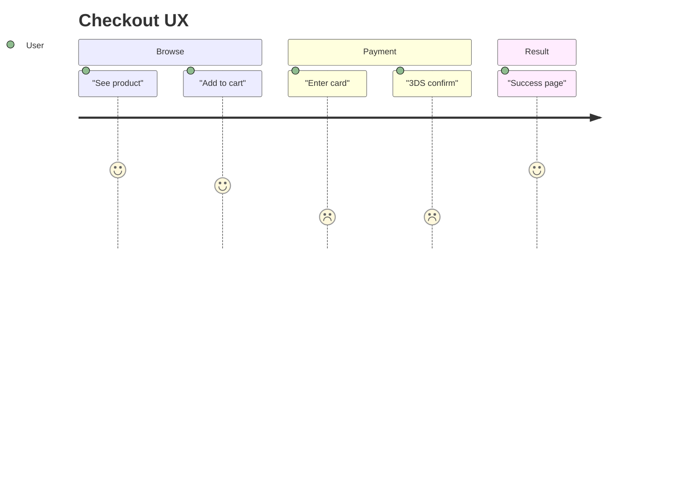
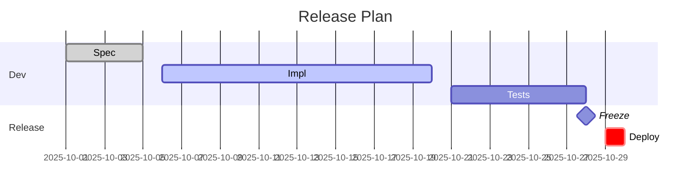
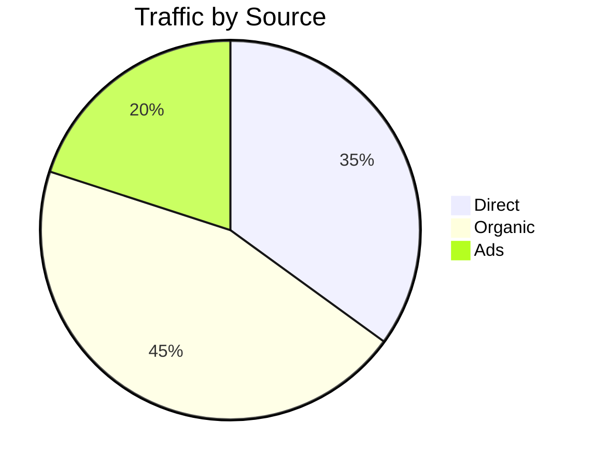

# Mermaid Diagram Templates

Renderer-compatible templates for each diagram type. Copy and customize as needed.

## Table of Contents

- [Flowchart](#flowchart)
- [Sequence](#sequence)
- [Class](#class)
- [State](#state)
- [ER (Entity-Relationship)](#er-entity-relationship)
- [Journey](#journey)
- [Gantt](#gantt)
- [Pie](#pie)

---

## Flowchart

Use `graph LR` (left-right) or `graph TB` (top-bottom). Avoid `flowchart` keyword for compatibility.

```mermaid
graph LR
  A["Start"] --> B{Auth?}
  B -->|Yes| C["Dashboard"]
  B -->|No|  D["Login"]
  C --> E["Settings"]
```

```text
Diagram: Auth flow (flowchart)
  [Start] --> {Auth?}
      {Auth?} -- Yes --> [Dashboard]
      {Auth?} -- No  --> [Login]
  [Dashboard] --> [Settings]
```

**Shapes:**
- Rectangle: `A["Label"]`
- Diamond (decision): `B{Question?}`
- Rounded: `C("Label")`
- Stadium: `D(["Label"])`

---

## Sequence



```text
Diagram: API call (sequence)
  1. User -> WebApp : Open
  2. WebApp -> API : GET /status
  3. API -> WebApp : 200
  4. WebApp -> User : OK
```

**Arrow types:**
- Solid: `->>` (request)
- Dashed: `-->>` (response)
- Notes: `Note over A,B: text`

---

## Class



```text
Diagram: User-Order model (class)
  +----------------+       +----------------+
  |     User       |       |     Order      |
  +----------------+       +----------------+
  | +id: String    |       | +id: String    |
  | +name: String  |  1..* | +total: Decimal|
  | +login(): bool |o------| +submit()      |
  +----------------+       +----------------+
```

**Relationships:**
- Association: `--`
- Aggregation: `o--`
- Composition: `*--`
- Inheritance: `<|--`

---

## State

Use `stateDiagram-v2` for nested states.



```text
Diagram: Editor states (state)
  (*) --> [Idle]
  [Idle] --fetch--> [Loading]
  [Loading] --ok--> [Ready]
  [Loading] --fail--> [Error]

  [Ready] contains:
    [Viewing] <--edit/save--> [Editing]

  [Error] --retry--> [Idle]
```

---

## ER (Entity-Relationship)



```text
Diagram: E-commerce schema (ER)
  USER ||--o{ ORDER        (one-to-many)
  ORDER ||--|{ ORDER_LINE  (one-to-many, identifying)
  PRODUCT ||--o{ ORDER_LINE

  USER: id, email
  PRODUCT: id, name, price
```

**Cardinality:**
- `||--o{` : one-to-many
- `||--|{` : one-to-many (identifying)
- `}o--o{` : many-to-many

---

## Journey



```text
Diagram: Checkout UX (journey)
  Browse:
    See product  [*****] 5
    Add to cart  [****-] 4
  Payment:
    Enter card   [**---] 2
    3DS confirm  [**---] 2
  Result:
    Success page [*****] 5
```

**Scores:** 1-5 (higher = better experience)

---

## Gantt



```text
Diagram: Release Plan (gantt)
  Oct 1-5:   [Spec]     done
  Oct 6-20:  [Impl]     active
  Oct 21-27: [Tests]    pending
  Oct 28:    <Freeze>   milestone
  Oct 29:    [Deploy]   critical
```

**Task states:** `done`, `active`, `crit`, or blank

---

## Pie



```text
Diagram: Traffic by Source (pie)
  Organic: 45%  ████████████
  Direct:  35%  █████████
  Ads:     20%  █████
```

**Note:** Prefer tables when precision matters.
