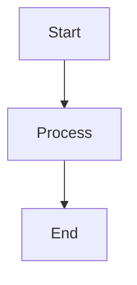

# Obsidian Markdown Syntax Reference

This reference provides comprehensive details on Obsidian-specific Markdown formatting and syntax.

## Text Styling

**Bold:**
```markdown
**Bold Text**
```

**Italic:**
```markdown
*Italic Text*
```

**Highlight:**
```markdown
==Highlighted Text==
```

**Strikethrough:**
```markdown
~~Strikethrough~~
```

**Combined:**
```markdown
**_Bold and Italic_**
==**Bold Highlight**==
```

## Headings

```markdown
# Heading 1 (Page Title)
## Heading 2 (Main Section)
### Heading 3 (Subsection)
#### Heading 4 (Minor Subsection)
##### Heading 5
###### Heading 6
```

Best practices:
- Use only one H1 per note (the title)
- Create logical hierarchy with H2/H3 for sections
- Avoid skipping heading levels

## Lists

**Bulleted Lists:**
```markdown
- Item 1
- Item 2
  - Nested item 2a
  - Nested item 2b
- Item 3

* Also works with asterisks
* Another item
```

**Numbered Lists:**
```markdown
1. First item
2. Second item
   1. Nested item
   2. Another nested
3. Third item
```

**Task Lists:**
```markdown
- [ ] Incomplete task
- [x] Completed task
- [>] Forwarded task
- [<] Scheduled task
- [-] Cancelled task
- [!] Important task
- [?] Question task
```

## Links and References

**Internal Links (Wikilinks):**
```markdown
[[Note Name]]                    # Basic link
[[Note Name|Display Text]]       # Link with alias
[[Note Name#Heading]]            # Link to specific heading
[[Note Name#^blockid]]           # Link to specific block
[[Folder/Note Name]]             # Link with folder path
```

**External Links:**
```markdown
[Display Text](https://example.com)
[Link with title](https://example.com "Hover text")
<https://example.com>  # Auto-linked URL
```

**Reference-Style Links:**
```markdown
[Link text][reference]

[reference]: https://example.com "Optional title"
```

## Embeds

**Embed Notes:**
```markdown
![[Note Name]]                   # Embed entire note
![[Note Name#Heading]]           # Embed from heading onward
![[Note Name#^blockid]]          # Embed specific block
```

**Embed Images:**
```markdown
![[image.png]]                   # Embed at original size
![[image.png|300]]               # Embed with width 300px
![[image.png|300x200]]           # Embed with specific dimensions
```

**Embed PDFs:**
```markdown
![[document.pdf]]                # Embed PDF
![[document.pdf#page=3]]         # Embed specific page
```

**Embed Audio/Video:**
```markdown
![[audio.mp3]]
![[video.mp4]]
```

## Callouts

Basic callout syntax:
```markdown
> [!NOTE]
> This is a note callout.
```

**Available Callout Types:**
- `[!NOTE]` - General notes (blue)
- `[!TIP]` - Helpful tips (cyan)
- `[!IMPORTANT]` - Important information (purple)
- `[!WARNING]` - Warnings (yellow)
- `[!CAUTION]` - Critical warnings (red)
- `[!INFO]` - Information (blue)
- `[!TODO]` - To-do items (blue)
- `[!SUCCESS]` / `[!CHECK]` - Success messages (green)
- `[!QUESTION]` / `[!HELP]` / `[!FAQ]` - Questions (yellow)
- `[!FAILURE]` / `[!FAIL]` / `[!MISSING]` - Failures (red)
- `[!DANGER]` / `[!ERROR]` - Danger/errors (red)
- `[!BUG]` - Bug reports (red)
- `[!EXAMPLE]` - Examples (purple)
- `[!QUOTE]` / `[!CITE]` - Quotations (gray)

**Collapsible Callouts:**
```markdown
> [!NOTE]- Collapsed by default
> Content here.

> [!NOTE]+ Expanded by default
> Content here.
```

**Custom Titles:**
```markdown
> [!TIP] Custom Title Here
> Content with custom title.
```

**Nested Callouts:**
```markdown
> [!INFO]
> Outer callout
> > [!WARNING]
> > Nested callout inside
```

## Code Blocks

**Inline Code:**
```markdown
Use `code` for inline code.
```

**Code Blocks:**
````markdown
```python
def hello_world():
    print("Hello, World!")
```
````

**Code Blocks with Line Numbers:**
````markdown
```python {1-3,5}
# Lines 1-3 and 5 will be highlighted
def example():
    pass

    return True
```
````

## Blockquotes

```markdown
> Simple blockquote

> Multi-line
> blockquote
> continues here

> Nested
> > blockquote
> > > goes deeper
```

## Tables

```markdown
| Column 1 | Column 2 | Column 3 |
|----------|----------|----------|
| Cell 1   | Cell 2   | Cell 3   |
| Cell 4   | Cell 5   | Cell 6   |
```

**Alignment:**
```markdown
| Left | Center | Right |
|:-----|:------:|------:|
| L1   | C1     | R1    |
| L2   | C2     | R2    |
```

## Tags

```markdown
#tag                # Simple tag
#nested/tag         # Nested tag
#multi-word-tag     # Multi-word tag

#tag/subtag/deep    # Deep nesting
```

**Tags in YAML:**
```yaml
---
tags: [tag1, tag2, nested/tag]
---
```

## YAML Frontmatter

```yaml
---
# Common metadata fields
title: Note Title
date: 2025-12-07
modified: 2025-12-07
tags: [tag1, tag2]
aliases: [Alternative Name, Alias 2]
status: draft|in-progress|complete|archived
type: note|project|area|resource|moc
author: Your Name
category: Category Name

# Custom fields
priority: high|medium|low
due: YYYY-MM-DD
project: [[Project Name]]
---
```

## Mathematical Expressions

**Inline Math:**
```markdown
$E = mc^2$
```

**Block Math:**
```markdown
$$
\int_0^\infty f(x)dx
$$
```

## Diagrams (Mermaid)

````markdown

````

## Comments

```markdown
%% This is a comment - won't render %%

%%
Multi-line
comment
%%
```

## Footnotes

```markdown
Here's a sentence with a footnote.[^1]

[^1]: This is the footnote content.
```

## Block References

Create a block ID:
```markdown
This is a paragraph. ^block-id
```

Reference the block:
```markdown
![[Note Name#^block-id]]
```

## Horizontal Rules

```markdown
---
or
***
or
___
```

## Escape Characters

Use backslash to escape special characters:
```markdown
\*Not italic\*
\[\[Not a link\]\]
\#Not a tag
```

## Advanced Features

### Dataview Queries

````markdown
```dataview
TABLE field1, field2
FROM #tag
WHERE condition
SORT field ASC
```
````

### Canvas Links

```markdown
[[canvas-name.canvas]]
```

### Attachments

Configure attachment folder in settings, then drag-and-drop files into notes:
```markdown
![[attachment.pdf]]
![[attachment.xlsx]]
```
