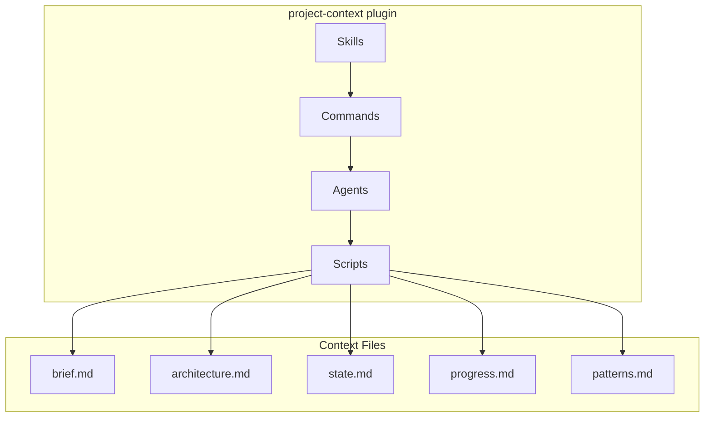

# Architecture

## Tech Stack
Pure Claude Code plugin — markdown-based skills, commands, agents, and Python utility scripts

## System Overview

**Flow:** Users invoke skills/commands → agents execute tasks → scripts manage .project-context/ files

## Key Decisions
| Decision | Rationale | Date |
|----------|-----------|------|
| Markdown-only storage | No external deps, works natively in Claude Code | 2026-02-20 |
| Python scripts for file manipulation | Reliable, deterministic over LLM string ops | - |
| Git URL + local path deps | Cover both monorepo and remote repo use cases | - |
| PostToolUse hooks for context enforcement | Hard-block on missing state.md/progress.md; soft-warn for architecture.md/patterns.md | 2026-03-04 |

---
*Last updated: 2026-03-08*
