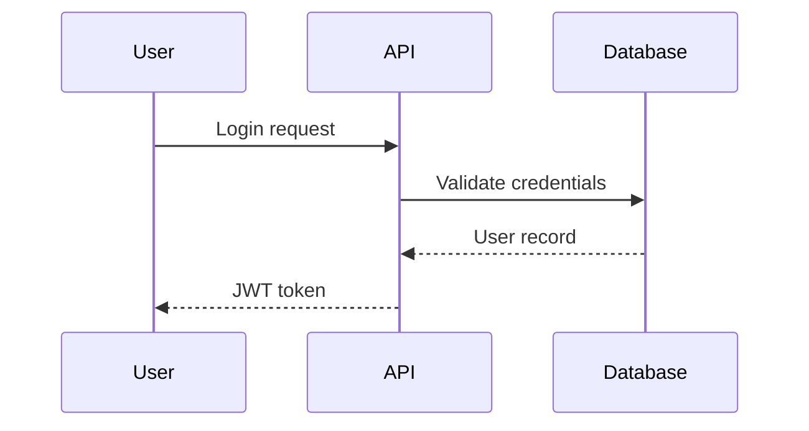

# Project Context Plugin

Maintain project context across Claude Code sessions with structured documentation files. Similar to [Cline Memory Bank](https://docs.cline.bot/prompting/cline-memory-bank) - stores project goals, architecture diagrams, progress, and patterns.

## Features

- **4 Structured Context Files** - Brief, Architecture, Progress, Patterns
- **Intelligent Planning** - Feature/project planning with requirement gathering (new in v1.1)
- **Mermaid Diagrams** - Visual architecture and flow documentation
- **Multiple Update Sources** - Chat history, code scanning, or manual input
- **AI Agent Integration** - Auto-updates CLAUDE.md and AGENTS.md
- **Validation** - Check completeness and freshness

## Installation

```bash
# Add marketplace
/plugin marketplace add golovachruslan/claude-pro-skills

# Install plugin
/plugin install project-context@claude-pro-skills
```

## Quick Start

```bash
# Initialize project context
/project-context:init

# Update context from recent work
/project-context:update

# Validate context files
/project-context:validate
```

## Context Files

The plugin creates 4 files in `.project-context/`:

| File | Purpose | Update Frequency |
|------|---------|------------------|
| `brief.md` | Project goals, scope, requirements | Rarely |
| `architecture.md` | Tech stack, Mermaid diagrams, system design | Often |
| `progress.md` | Current status, completed/pending work | Frequently |
| `patterns.md` | Established patterns and learnings | As needed |

## Commands

### `/project-context:plan`

**NEW in v1.1** - Intelligent feature and project planning with systematic requirement gathering:

```bash
# Start planning a feature or project
/project-context:plan
```

The planner skill will:
1. **Ask clarifying questions** instead of making assumptions (uses AskUserQuestion tool)
2. **Gather requirements** systematically (functional, technical, design)
3. **Identify constraints** (performance, security, scale, timeline)
4. **Create structured plans** with phases, tasks, and deliverables
5. **Document trade-offs** and design decisions
6. **Define success criteria** and next steps

The planner excels at:
- Feature planning (new functionality)
- Project planning (multi-feature initiatives)
- Architecture planning (system design)
- Refactoring planning (technical improvements)

Plans can be saved to `.project-context/plans/[feature-name].md` for reference across sessions.

**Example planning session:**
```
User: /project-context:plan
User: I want to add dark mode to my app

Claude: I need to understand the scope and technical approach for dark mode.

1. Should dark mode be:
   - System preference based (auto-switch with OS)
   - Manual toggle only
   - Both options available?

2. What's the scope:
   - Entire application
   - Specific sections only?

[... continues with requirement gathering, then creates structured plan]
```

### `/project-context:init`

Initialize project context structure:
- Creates `.project-context/` directory with 4 template files
- Interactive wizard for initial content
- Auto-updates CLAUDE.md and AGENTS.md with context references

### `/project-context:update [file] [--source]`

Update context files from various sources:

```bash
# Update from conversation
/project-context:update --chat

# Update from code changes
/project-context:update --scan

# Update specific file interactively
/project-context:update architecture --input

# Smart update (auto-detects source)
/project-context:update
```

**Files:** `brief`, `architecture`, `progress`, `patterns`

**Sources:**
- `--chat` - Extract from current conversation
- `--scan` - Scan codebase for changes (git diff)
- `--input` - Interactive input

### `/project-context:validate`

Check context files for:
- Missing required files
- Empty or incomplete sections
- Mermaid syntax errors
- Stale content (outdated timestamps)
- References to non-existent files

## Architecture Documentation

The `architecture.md` file emphasizes visual documentation with Mermaid diagrams. Each diagram includes step-by-step descriptions:

```markdown
## User Authentication Flow



**Flow Description:**
1. User submits login credentials
2. API validates against database
3. Database returns user record
4. API generates and returns JWT token
```

## AI Agent Integration

When initialized, the plugin adds context references to:

**CLAUDE.md:**
```markdown
## Project Context
This project uses structured context files in `.project-context/`:
- See `.project-context/brief.md` for project goals
- See `.project-context/architecture.md` for system diagrams
- See `.project-context/progress.md` for current status
- See `.project-context/patterns.md` for patterns and learnings

When starting work, read these files to understand project state.
```

**AGENTS.md:**
```markdown
## Project Context
Before executing tasks, agents should read `.project-context/` files.
```

## Best Practices

1. **Update progress.md frequently** - At least weekly during active development
2. **Add diagrams for every flow** - Mermaid diagrams with step descriptions
3. **Document patterns immediately** - Capture learnings before you forget
4. **Keep brief.md stable** - Only update on major scope changes
5. **Validate regularly** - Run `/project-context:validate` to catch staleness

## File Structure

```
.project-context/
├── brief.md        # Project goals and scope
├── architecture.md # System design with Mermaid diagrams
├── progress.md     # Current status and work items
└── patterns.md     # Established patterns and learnings
```

## Comparison with Cline Memory Bank

| Feature | Cline Memory Bank | Project Context |
|---------|-------------------|-----------------|
| Files | 6 files | 4 files (simplified) |
| Diagrams | Text descriptions | Mermaid diagrams |
| Updates | Manual | Multiple sources (chat, scan, input) |
| Validation | None | Built-in validation |
| AI Integration | Generic | CLAUDE.md/AGENTS.md specific |

## License

MIT
