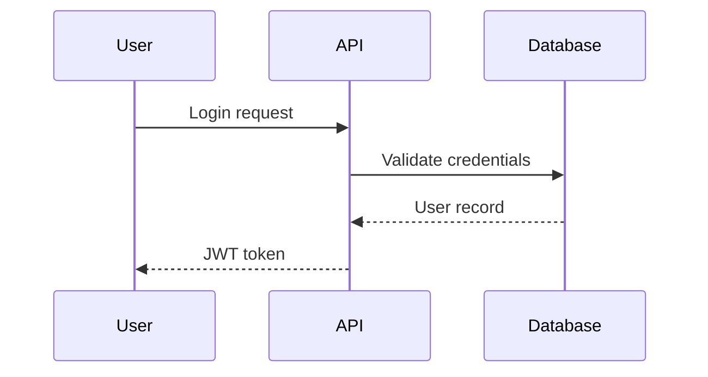

# Project Context Plugin

Maintain project context across Claude Code sessions with structured documentation files. Similar to [Cline Memory Bank](https://docs.cline.bot/prompting/cline-memory-bank) - stores project goals, architecture diagrams, progress, and patterns.

## Features

- **5 Structured Context Files** - Brief, Architecture, State, Progress, Patterns
- **Brainstorm-First Workflow** - Discuss → Plan → Implement → Retro
- **Native Claude Code Integration** (new in v2.1):
  - **Agent Teams** — True parallel execution with inter-agent coordination for `/implement` and `/challenge`
  - **Plan Mode** — Read-only research phase before planning via `/plan`
  - **Persistent Tasks** — DAG-based task tracking that survives across sessions
- **Intelligent Planning** - Feature/project planning with requirement gathering
- **Adversarial Challenge Mode** - Six Critics framework with optional Agent Teams for parallel analysis
- **Retrospective Analysis** - Extract learnings from conversations and preserve insights
- **Session Continuity** - Pause/resume with native Tasks state persistence
- **Smart Routing** - `/next` command analyzes state and recommends actions
- **Quick Mode** - Streamlined path for ad-hoc tasks
- **Multiple Update Sources** - Chat history, code scanning, or manual input
- **Mermaid Diagrams** - Visual architecture and flow documentation
- **AI Agent Integration** - Auto-updates CLAUDE.md and AGENTS.md with managed sections
- **OpenSpec-Aligned** - Uses HTML comment markers for managed configuration sections
- **Validation** - Check completeness and freshness

## Installation

```bash
# Add marketplace
/plugin marketplace add golovachruslan/claude-pro-skills

# Install plugin
/plugin install project-context@claude-pro-skills
```

## Quick Start

```bash
# Initialize project context
/project-context:init

# Update context from recent work
/project-context:update

# Validate context files
/project-context:validate
```

## Native Claude Code Features (v2.1)

This plugin leverages three native Claude Code features for enhanced workflows:

### Agent Teams (Swarm Mode)

Enable in settings: `CLAUDE_CODE_EXPERIMENTAL_AGENT_TEAMS=1`

- **`/project-context:implement`** — Team lead coordinates, teammates execute independent tasks in parallel with fresh context windows
- **`/project-context:challenge --team`** — Each of the Six Critics runs as a separate teammate, enabling deeper analysis and inter-critic cross-referencing

### Plan Mode

- **`/project-context:plan`** — Enter Plan Mode (`Shift+Tab` x2) for read-only research before planning
- **`opusplan` model** — Use `/model opusplan` for Opus-quality planning with Sonnet-speed execution

### Persistent Tasks

- Plans register tasks in Claude Code's native task system (`Ctrl+T` to view)
- Tasks use DAG-based dependency tracking matching plan phases
- Task state persists across sessions in `~/.claude/tasks/`
- Set `CLAUDE_CODE_TASK_LIST_ID=project-name` for cross-session coordination
- **`/project-context:pause`** exports task state; **`/project-context:resume`** restores it

## Context Files

The plugin creates 5 files in `.project-context/`:

| File | Purpose | Update Frequency |
|------|---------|------------------|
| `brief.md` | Project goals, scope, requirements | Rarely (on pivots) |
| `architecture.md` | Tech stack, Mermaid diagrams, system design | On architecture changes |
| `state.md` | Current position, blockers, next action | Every session |
| `progress.md` | Completed/in-progress/upcoming work | Multiple times per week |
| `patterns.md` | Established patterns and learnings | As patterns emerge |

## Commands

### `/project-context:retro`

**NEW in v1.2** - Retrospective analysis to extract and preserve key learnings:

```bash
# Analyze conversation and capture learnings
/project-context:retro
```

The retro skill will:
1. **Analyze conversation** - Review session for learnings, decisions, patterns, errors
2. **Extract insights** - Identify valuable knowledge to preserve
3. **Categorize learnings** - Map insights to appropriate context files
4. **Propose updates** - Show exactly what will be added and where
5. **Ask confirmation** - Get user approval before applying changes
6. **Apply updates** - Add approved content to the right files

The retro excels at capturing:
- **Key learnings** - What worked, what didn't, new discoveries
- **Technical decisions** - Architecture choices, library selections, trade-offs
- **Patterns** - Coding patterns, best practices, anti-patterns to avoid
- **Solutions** - Bug fixes, debugging insights, error handling approaches
- **Progress** - Completed features, current work, next steps

**Example retro session:**
```
User: /project-context:retro

Claude: I've analyzed our dark mode implementation session. Here are the key learnings:

## Proposed Updates

### 1. patterns.md - Theme Management
**Insight:** Established pattern for theme switching with Context API
**Proposed Addition:**
[Shows exact content to be added]

### 2. progress.md - Recent Completions
**Insight:** Dark mode feature is complete
**Proposed Addition:**
[Shows completion entry]

Do these updates look good? Should I modify anything before applying?
```

### `/project-context:plan`

**NEW in v1.1** - Intelligent feature and project planning with systematic requirement gathering:

```bash
# Start planning a feature or project
/project-context:plan
```

The planner skill will:
1. **Ask clarifying questions** instead of making assumptions (uses AskUserQuestion tool)
2. **Gather requirements** systematically (functional, technical, design)
3. **Identify constraints** (performance, security, scale, timeline)
4. **Create structured plans** with phases, tasks, and deliverables
5. **Document trade-offs** and design decisions
6. **Define success criteria** and next steps

The planner excels at:
- Feature planning (new functionality)
- Project planning (multi-feature initiatives)
- Architecture planning (system design)
- Refactoring planning (technical improvements)

Plans can be saved to `.project-context/plans/[feature-name].md` for reference across sessions.

**Example planning session:**
```
User: /project-context:plan
User: I want to add dark mode to my app

Claude: I need to understand the scope and technical approach for dark mode.

1. Should dark mode be:
   - System preference based (auto-switch with OS)
   - Manual toggle only
   - Both options available?

2. What's the scope:
   - Entire application
   - Specific sections only?

[... continues with requirement gathering, then creates structured plan]
```

### `/project-context:init`

Initialize project context structure:
- Creates `.project-context/` directory with 4 template files
- Interactive wizard for initial content
- Auto-updates CLAUDE.md and AGENTS.md with context references

### `/project-context:update [file] [--source]`

Update context files from various sources:

```bash
# Update from conversation
/project-context:update --chat

# Update from code changes
/project-context:update --scan

# Update specific file interactively
/project-context:update architecture --input

# Smart update (auto-detects source)
/project-context:update
```

**Files:** `brief`, `architecture`, `progress`, `patterns`

**Sources:**
- `--chat` - Extract from current conversation
- `--scan` - Scan codebase for changes (git diff)
- `--input` - Interactive input

### `/project-context:validate`

Check context files for:
- Missing required files
- Empty or incomplete sections
- Mermaid syntax errors
- Stale content (outdated timestamps)
- References to non-existent files

## Architecture Documentation

The `architecture.md` file emphasizes visual documentation with Mermaid diagrams. Each diagram includes step-by-step descriptions:

```markdown
## User Authentication Flow



**Flow Description:**
1. User submits login credentials
2. API validates against database
3. Database returns user record
4. API generates and returns JWT token
```

## AI Agent Integration

Following OpenSpec conventions, the plugin uses **managed configuration sections** in CLAUDE.md and AGENTS.md. These sections are delimited by HTML comment markers and can be automatically refreshed by project-context commands.

### Managed Sections

When initialized, the plugin adds managed sections using markers:

**CLAUDE.md:**
```markdown
<!-- PROJECT-CONTEXT:START -->
## Project Context

These instructions are for AI assistants working in this project.

Always read `.project-context/` files when starting work to understand:
- Project goals and scope (`brief.md`)
- System architecture and flows (`architecture.md`)
- Current status and blockers (`progress.md`)
- Established patterns and learnings (`patterns.md`)

Use these files to:
- Understand project constraints before making changes
- Follow established patterns and conventions
- Avoid duplicate work or conflicting approaches
- Maintain consistency with project goals

Keep this managed block so project-context commands can refresh the instructions.

<!-- PROJECT-CONTEXT:END -->
```

**AGENTS.md:**
```markdown
<!-- PROJECT-CONTEXT:START -->
## Project Context

These instructions are for AI agents working in this project.

Before executing tasks, read `.project-context/` files:
- `brief.md` - Understand project scope and goals
- `architecture.md` - Review system design and flows
- `progress.md` - Check current status and blockers
- `patterns.md` - Follow established patterns

Use these files to:
- Align work with project goals
- Apply established architecture patterns
- Avoid conflicts with current work
- Make context-aware decisions

Keep this managed block so project-context commands can refresh the instructions.

<!-- PROJECT-CONTEXT:END -->
```

### Benefits of Managed Sections

1. **Automatic Updates** - `/project-context:update` refreshes managed content
2. **User Content Protected** - Content outside markers is never modified
3. **Consistent Configuration** - Same structure across all projects
4. **OpenSpec Compatible** - Uses same pattern as OpenSpec and other tools
5. **Idempotent** - Safe to run init/update multiple times

## Best Practices

1. **Update progress.md frequently** - At least weekly during active development
2. **Add diagrams for every flow** - Mermaid diagrams with step descriptions
3. **Document patterns immediately** - Capture learnings before you forget
4. **Keep brief.md stable** - Only update on major scope changes
5. **Validate regularly** - Run `/project-context:validate` to catch staleness

## File Structure

```
.project-context/
├── brief.md        # Project goals and scope
├── architecture.md # System design with Mermaid diagrams
├── state.md        # Current position, blockers, next action
├── progress.md     # Completed/in-progress/upcoming work
├── patterns.md     # Established patterns and learnings
├── continue.md     # Session handoff (created by /pause)
└── plans/          # Saved implementation plans
```

## Comparison with Cline Memory Bank

| Feature | Cline Memory Bank | Project Context |
|---------|-------------------|-----------------|
| Files | 6 files | 5 files (brief, architecture, state, progress, patterns) |
| Diagrams | Text descriptions | Mermaid diagrams |
| Updates | Manual | Multiple sources (chat, scan, input) |
| Validation | None | Built-in validation |
| AI Integration | Generic | CLAUDE.md/AGENTS.md specific |
| Parallel execution | None | Agent Teams + Task subagents |
| Planning workflow | None | Plan Mode + discuss → plan → implement |
| Task persistence | None | Native Tasks with DAG dependencies |
| Session continuity | None | pause/resume with task state export |

## License

MIT
