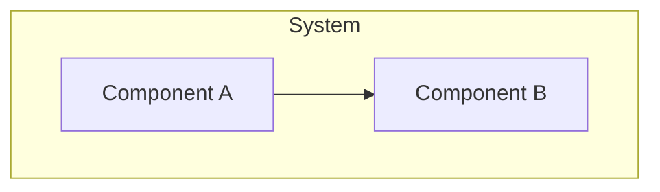

# Initialize Project Context

Create the `.project-context/` directory with 5 structured markdown files for maintaining project context across sessions.

## Workflow

### Step 1: Check Existing Context

```bash
ls -la .project-context/ 2>/dev/null
```

If exists, ask user: "Project context already exists. Reinitialize (overwrites) or skip?"

### Step 2: Create Directory Structure

```bash
mkdir -p .project-context/plans
```

### Step 3: Gather Initial Context

Ask user for basic project information using AskUserQuestion:

1. **Project name and brief description** (for brief.md)
2. **Primary tech stack** (for architecture.md)
3. **Current focus/goals** (for progress.md)

### Step 4: Create Context Files

Create 5 files using templates from the project-context skill's `references/file-templates.md`.

#### brief.md
```markdown
# Project Brief

## Overview
[Project name and description from user input]

## Goals
- [Primary goal]

## Scope
### In Scope
-

### Out of Scope
-

---
*Last updated: [current date]*
```

#### architecture.md
```markdown
# Architecture

## Tech Stack
[From user input]

## System Overview



**Flow:** [Brief description]

## Key Decisions
| Decision | Rationale | Date |
|----------|-----------|------|
| | | |

---
*Last updated: [current date]*
```

#### state.md
```markdown
# State

## Current Position
**Phase:** Planning
**Active Plan:** none
**Focus:** [From user input]

## Session Info
**Last Session:** [current date]
**Context:** Initial setup

## Blockers
- None

## Decisions Pending
- None

## Next Action
Run /project-context:discuss to brainstorm first feature

---
*Last updated: [current date]*
```

#### progress.md
```markdown
# Progress

## Completed
- [x] Project context initialized ([current date])

## In Progress
- [ ]

## Upcoming
- [ ]

## Known Issues
-

---
*Last updated: [current date]*
```

#### patterns.md
```markdown
# Patterns & Learnings

## Code Patterns
-

## Naming Conventions
-

## Learnings
-

## Anti-Patterns
-

---
*Last updated: [current date]*
```

### Step 5: Update CLAUDE.md and AGENTS.md

Use the Python script for reliable managed section updates:

```bash
python project-context/scripts/manage_context.py update-sections --file CLAUDE.md
python project-context/scripts/manage_context.py update-sections --file AGENTS.md
```

If the script is not available, manually check for and add managed sections using HTML comment markers (`<!-- PROJECT-CONTEXT:START -->` / `<!-- PROJECT-CONTEXT:END -->`).

### Step 6: Confirmation

Display summary:
- List created files (5 files + plans directory)
- Show any updates to CLAUDE.md/AGENTS.md
- Suggest next steps: "Run `/project-context:discuss` to brainstorm your first feature"
