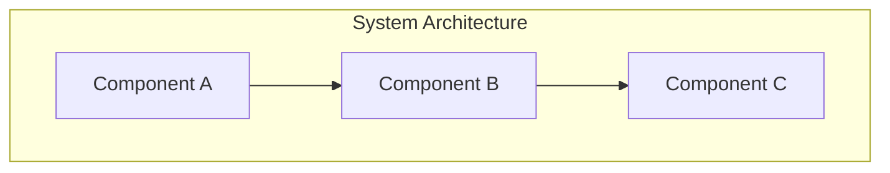

# Initialize Project Context

Create the `.project-context/` directory with 4 structured markdown files for maintaining project context across sessions.

## Workflow

### Step 1: Check Existing Context

Check if `.project-context/` already exists:

```bash
ls -la .project-context/ 2>/dev/null
```

If exists, ask user:
- "Project context already exists. Would you like to reinitialize (overwrites existing) or skip?"

### Step 2: Create Directory Structure

```bash
mkdir -p .project-context
```

### Step 3: Gather Initial Context

Ask user for basic project information using AskUserQuestion:

1. **Project name and brief description** (for brief.md)
2. **Primary tech stack** (for architecture.md)
3. **Current focus/goals** (for progress.md)

### Step 4: Create Context Files

Create 4 files with templates. Use the reference templates from the skill.

#### brief.md
```markdown
# Project Brief

## Overview
[Project name and description from user input]

## Goals
- [Primary goal]
- [Secondary goals]

## Scope
### In Scope
-

### Out of Scope
-

## Success Criteria
-

---
*Last updated: [current date]*
```

#### architecture.md
```markdown
# Architecture

## Tech Stack
[From user input]

## System Overview



**Flow Description:**
1. Step 1 description
2. Step 2 description
3. Step 3 description

## Key Decisions
| Decision | Rationale | Date |
|----------|-----------|------|
| | | |

---
*Last updated: [current date]*
```

#### progress.md
```markdown
# Progress

## Current Focus
[From user input]

## Status
- **Phase**: [Development/Testing/Production]
- **Sprint/Cycle**:
- **Blockers**: None

## Completed
- [ ]

## In Progress
- [ ]

## Upcoming
- [ ]

## Known Issues
-

---
*Last updated: [current date]*
```

#### patterns.md
```markdown
# Patterns & Learnings

## Established Patterns

### Code Patterns
-

### Architecture Patterns
-

### Process Patterns
-

## Learnings

### What Worked
-

### What Didn't Work
-

### Key Insights
-

---
*Last updated: [current date]*
```

### Step 5: Update AI Agent Configuration Files

#### Update CLAUDE.md (if exists)

Check if CLAUDE.md exists in project root:
```bash
ls CLAUDE.md 2>/dev/null
```

If exists, append the following section (if not already present):

```markdown

## Project Context

This project uses structured context files in `.project-context/`:
- See `.project-context/brief.md` for project goals and scope
- See `.project-context/architecture.md` for system diagrams and flows
- See `.project-context/progress.md` for current status and blockers
- See `.project-context/patterns.md` for established patterns and learnings

When starting work, read these files to understand project state.
```

#### Update AGENTS.md (if exists)

Check if AGENTS.md exists:
```bash
ls AGENTS.md 2>/dev/null
```

If exists, append:

```markdown

## Project Context

Before executing tasks, agents should read `.project-context/` files:
- `brief.md` - Understand project scope and goals
- `architecture.md` - Review system design and flows
- `progress.md` - Check current status and blockers
- `patterns.md` - Follow established patterns
```

### Step 6: Confirmation

Display summary:
- List created files
- Show any updates to CLAUDE.md/AGENTS.md
- Suggest next steps: "Run `/project-context:update` to add more detail"

## Tips

- Keep brief.md stable - it's the foundation
- Update architecture.md when adding new components or flows
- Update progress.md frequently during active development
- Add to patterns.md when you learn something valuable
