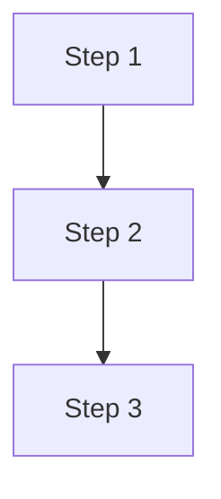
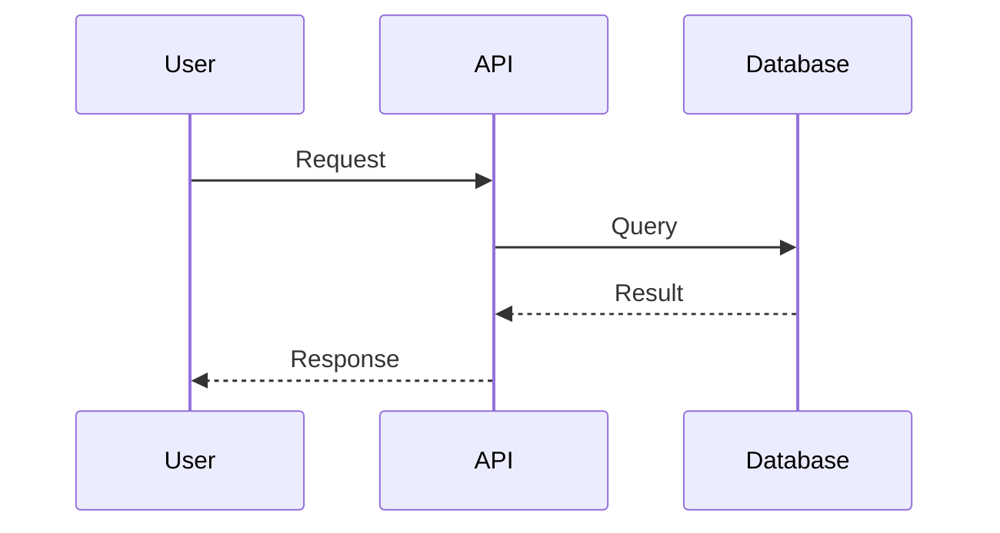

# Update Project Context

Update one or more project context files based on different sources.

## Arguments

- `file` (optional): Specific file to update
  - `brief` - Project goals and scope
  - `architecture` - System diagrams and flows
  - `progress` - Current status and work items
  - `patterns` - Patterns and learnings
  - If omitted: Smart update of relevant files

- `--source` (optional): Where to get update information
  - `--chat` - Extract from current conversation history
  - `--scan` - Scan codebase for changes (git diff, new files)
  - `--input` - Interactive input from user
  - Default: Smart detection (chat if recent discussion, else scan)

## Workflow

### Step 1: Verify Context Exists

```bash
ls .project-context/*.md 2>/dev/null
```

If not found, suggest: "Run `/project-context:init` first to create context structure."

### Step 2: Determine Update Source

Based on argument or smart detection:

**Smart Detection Logic:**
1. Check if there's meaningful conversation context → use chat
2. Check git status for recent changes → use scan
3. Otherwise → prompt for input

### Step 3: Gather Update Information

#### For --chat source:
Analyze the current conversation for:
- New decisions made
- Problems solved
- Architecture changes discussed
- Progress updates mentioned
- Patterns discovered

Extract relevant information and categorize by file.

#### For --scan source:
```bash
# Check recent git changes
git diff --stat HEAD~5 2>/dev/null || git status --short

# Find recently modified files
find . -name "*.ts" -o -name "*.js" -o -name "*.py" -mtime -1 2>/dev/null | head -20

# Check for new directories/components
git status --short | grep "^A" | head -10
```

Analyze changes for:
- New components/modules → architecture.md
- New patterns/approaches → patterns.md
- Completed work → progress.md

#### For --input source:
Ask user specific questions based on the file being updated.

### Step 4: Update Files

For each file being updated:

1. Read current content
2. Preserve existing content
3. Append new information with timestamp
4. Show diff of changes

#### Updating brief.md
- Add new goals or scope changes
- Update success criteria if changed

#### Updating architecture.md
- **Add/update Mermaid diagrams** for new components or flows
- Each diagram MUST have a step-by-step description below it
- Update tech stack if new technologies added
- Add key decisions with rationale

**Mermaid Diagram Format:**
```markdown
## [Flow/Component Name]



**Flow Description:**
1. **Step 1**: Description of what happens
2. **Step 2**: Description of next step
3. **Step 3**: Final step description
```

#### Updating progress.md
- Move completed items from "In Progress" to "Completed"
- Add new items to appropriate sections
- Update current focus
- Note any blockers

#### Updating patterns.md
- Add new patterns discovered
- Document what worked/didn't work
- Add key insights

### Step 5: Add Timestamp

Each updated file should have its "Last updated" line modified:

```markdown
---
*Last updated: YYYY-MM-DD HH:MM*
```

### Step 6: Show Summary

Display:
- Files updated
- Key changes made
- Diff preview (truncated if large)

## Examples

### Update from chat
```
/project-context:update --chat
```
Extracts decisions, progress, and learnings from conversation.

### Update architecture after adding new feature
```
/project-context:update architecture --scan
```
Scans code changes and updates architecture diagrams.

### Update progress interactively
```
/project-context:update progress --input
```
Prompts for status updates.

### Smart update all relevant files
```
/project-context:update
```
Detects best source and updates appropriate files.

## Architecture Update Guidelines

When updating architecture.md:

1. **Always use Mermaid diagrams** for visual representation
2. **Common diagram types:**
   - `graph TD` - Top-down flow
   - `graph LR` - Left-right flow
   - `sequenceDiagram` - API/interaction sequences
   - `classDiagram` - Component relationships
   - `flowchart` - Decision flows

3. **Every diagram needs:**
   - Clear title
   - Descriptive node labels
   - Step-by-step description below

4. **Example patterns:**



**API Flow:**
1. User sends request to API endpoint
2. API validates and queries database
3. Database returns result
4. API formats and sends response to user
