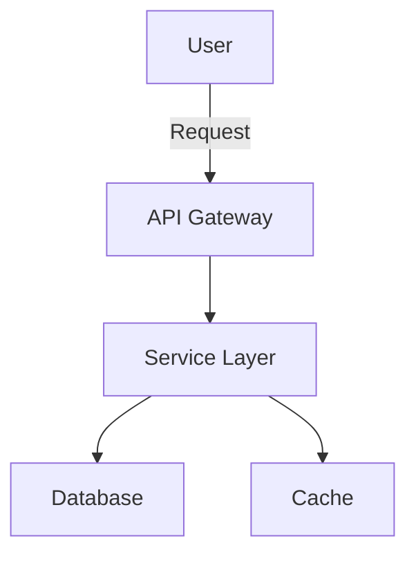

# Planning Templates

Complete templates for different types of plans. Use these as starting points and adapt to specific needs.

## Feature Plan Template

```markdown
# [Feature Name] Plan

**Status:** Planning | In Progress | Completed | On Hold
**Created:** YYYY-MM-DD
**Last Updated:** YYYY-MM-DD
**Owner:** [Name or team]
**Related Issues:** #123, #456

## Overview

### Problem Statement
[What problem does this solve? Why is it needed?]

### Solution Summary
[High-level description of the proposed solution]

### Success Metrics
- Metric 1: [How measured]
- Metric 2: [How measured]

## Requirements

### Functional Requirements
1. **[Requirement name]**
   - Description: [What it does]
   - User story: As a [role], I want [action] so that [benefit]
   - Acceptance criteria:
     - [ ] Criterion 1
     - [ ] Criterion 2

2. **[Requirement name]**
   - [Same structure]

### Non-functional Requirements
- **Performance:** [Response time, throughput expectations]
- **Security:** [Authentication, authorization, data protection]
- **Scalability:** [User load, data volume expectations]
- **Accessibility:** [WCAG level, screen reader support]
- **Browser/Platform:** [Supported browsers, devices, OS]
- **Reliability:** [Uptime expectations, error handling]

### Out of Scope
- Feature X (planned for Phase 2)
- Feature Y (not aligned with current goals)

## Technical Design

### Architecture

[Mermaid diagram or description of system components and interactions]



### Technology Stack
- **Frontend:** [Framework/library and why]
- **Backend:** [Framework/language and why]
- **Database:** [Type and why]
- **Infrastructure:** [Hosting, CI/CD, monitoring]
- **Third-party services:** [APIs, SDKs used]

### Key Components

#### Component 1: [Name]
- **Purpose:** [What it does]
- **Responsibilities:**
  - Responsibility 1
  - Responsibility 2
- **Interfaces:**
  - Input: [What it receives]
  - Output: [What it returns]
- **Dependencies:** [What it relies on]
- **Implementation notes:** [Technical details]

#### Component 2: [Name]
[Same structure]

### Data Model

```
Entity1:
  - field1: type (constraints)
  - field2: type (constraints)
  - relationships: [connections to other entities]

Entity2:
  - [Same structure]
```

### API Design

```
GET /api/resource
  - Purpose: [What it does]
  - Auth: [Required auth level]
  - Request params: [Parameters]
  - Response: [Shape of response]
  - Errors: [Possible error codes]

POST /api/resource
  - [Same structure]
```

## Implementation Plan

### Phase 1: Foundation (MVP)
**Goal:** [What this phase achieves - usually core functionality]
**Timeline:** [If known]

**Tasks:**
- [ ] Task 1: Set up [component]
  - Subtask 1a
  - Subtask 1b
- [ ] Task 2: Implement [feature]
- [ ] Task 3: Add [tests/docs]

**Deliverables:**
- Deliverable 1
- Deliverable 2

**Definition of Done:**
- [ ] Code reviewed and merged
- [ ] Tests passing (unit, integration)
- [ ] Documentation updated
- [ ] Deployed to staging
- [ ] Acceptance criteria met

### Phase 2: Enhancement
**Goal:** [What this phase adds]
**Dependencies:** Phase 1 complete, [other dependencies]

**Tasks:**
- [ ] Task 1
- [ ] Task 2

**Deliverables:**
- Deliverable 1

### Phase 3: Polish & Optimization
**Goal:** [Performance, UX improvements]

**Tasks:**
- [ ] Task 1
- [ ] Task 2

## Design Decisions & Trade-offs

### Decision 1: [What was decided]
**Options considered:**
- Option A: [Description]
  - Pros: [Benefits]
  - Cons: [Drawbacks]
- Option B: [Description]
  - Pros: [Benefits]
  - Cons: [Drawbacks]

**Chosen:** Option A

**Rationale:** [Why this was chosen]

**Trade-offs accepted:**
- We're accepting [cost] to gain [benefit]
- We're prioritizing [aspect] over [other aspect]

### Decision 2: [What was decided]
[Same structure]

## Risks & Mitigation

| Risk | Likelihood | Impact | Mitigation Strategy |
|------|------------|--------|---------------------|
| [Risk description] | High/Med/Low | High/Med/Low | [How we'll address it] |
| [Risk description] | High/Med/Low | High/Med/Low | [How we'll address it] |

## Dependencies

### External Dependencies
- **Dependency 1:** [Description, status, owner]
- **Dependency 2:** [Description, status, owner]

### Internal Dependencies
- **Dependency 1:** [Other feature/refactor needed first]
- **Dependency 2:** [Team/resource dependency]

## Testing Strategy

### Unit Tests
- Coverage target: [Percentage]
- Focus areas: [What to test thoroughly]

### Integration Tests
- Scenarios: [Key integration points to test]

### E2E Tests
- User flows: [Critical paths to cover]

### Performance Tests
- Load testing: [Expected load scenarios]
- Benchmarks: [Performance targets]

### Security Tests
- OWASP checks: [Security testing approach]
- Penetration testing: [If applicable]

## Monitoring & Observability

### Metrics to Track
- Metric 1: [What and why]
- Metric 2: [What and why]

### Logging
- Key events to log: [What to log]
- Log levels: [How to categorize]

### Alerts
- Alert 1: [Condition and action]
- Alert 2: [Condition and action]

## Documentation

### User Documentation
- [ ] User guide / tutorial
- [ ] API documentation
- [ ] Examples / sample code

### Developer Documentation
- [ ] Architecture overview
- [ ] Setup guide
- [ ] Contributing guidelines

## Rollout Plan

### Rollout Strategy
- [ ] Feature flag: [Name and purpose]
- [ ] Gradual rollout: [Percentage approach]
- [ ] Canary deployment: [Validation criteria]

### Rollback Plan
If issues arise:
1. [Immediate action]
2. [Rollback procedure]
3. [Communication plan]

## Future Enhancements

Not in current scope, but potential future work:
- Enhancement 1: [Description, why deferred]
- Enhancement 2: [Description, dependencies]

## Success Criteria

The feature is considered successful when:
- [ ] All functional requirements met
- [ ] All acceptance criteria passed
- [ ] Performance targets achieved: [Specific metrics]
- [ ] Security review passed
- [ ] User feedback: [Target satisfaction score or feedback]
- [ ] Adoption: [Usage target if applicable]

## Appendix

### Research & References
- [Link to research doc]
- [Link to design mockups]
- [Link to user feedback]

### Open Questions
- Question 1: [Question and who can answer]
- Question 2: [Question and deadline for answer]
```

## Project Plan Template

For larger projects spanning multiple features:

```markdown
# [Project Name] Plan

**Status:** Planning | Active | On Hold | Completed
**Duration:** [Start date] - [Target end date]
**Team:** [Members and roles]
**Stakeholders:** [Key stakeholders]

## Vision & Goals

### Vision Statement
[What is the long-term vision for this project?]

### Business Goals
1. Goal 1: [Measurable outcome]
2. Goal 2: [Measurable outcome]

### User Goals
1. [User need this addresses]
2. [User need this addresses]

### Success Metrics
- Metric 1: [Baseline → Target]
- Metric 2: [Baseline → Target]

## Project Scope

### In Scope
- Feature area 1
- Feature area 2

### Out of Scope
- Feature area X (future phase)
- Feature area Y (separate project)

### Assumptions
- Assumption 1
- Assumption 2

### Constraints
- Time: [Deadlines, milestones]
- Budget: [Resource constraints]
- Technical: [Platform, technology limitations]
- Regulatory: [Compliance requirements]

## User Research

### Target Users
- **Persona 1:** [Description, needs, pain points]
- **Persona 2:** [Description, needs, pain points]

### User Journeys
[Map of key user flows and touchpoints]

### Validation
- Research method 1: [Findings]
- Research method 2: [Findings]

## Technical Architecture

### System Overview
[High-level architecture diagram]

### Core Components
1. Component 1: [Purpose and responsibilities]
2. Component 2: [Purpose and responsibilities]

### Technology Stack
- Frontend: [Choices and rationale]
- Backend: [Choices and rationale]
- Infrastructure: [Choices and rationale]
- Data: [Choices and rationale]

### Integration Points
- Integration 1: [System and approach]
- Integration 2: [System and approach]

## Implementation Roadmap

### Phase 1: Foundation (Months 1-2)
**Goal:** [Core infrastructure and MVP features]

**Epics:**
1. **Epic 1:** [Name]
   - Feature 1.1
   - Feature 1.2
2. **Epic 2:** [Name]
   - Feature 2.1

**Deliverables:**
- Deliverable 1
- Deliverable 2

**Success Criteria:**
- [ ] Criterion 1
- [ ] Criterion 2

### Phase 2: Enhancement (Months 3-4)
[Same structure]

### Phase 3: Optimization (Months 5-6)
[Same structure]

## Risk Management

### High-Priority Risks

| Risk | Impact | Probability | Mitigation | Contingency |
|------|--------|-------------|------------|-------------|
| [Risk] | High | Medium | [Prevention] | [If it happens] |

### Risk Monitoring
- Review cadence: [Weekly/biweekly]
- Owner: [Who monitors]

## Resource Plan

### Team Structure
- Role 1: [Name, capacity, responsibilities]
- Role 2: [Name, capacity, responsibilities]

### External Resources
- Vendor 1: [What they provide]
- Consultant 1: [Expertise needed]

### Budget
- Development: [Allocation]
- Infrastructure: [Allocation]
- Third-party services: [Allocation]
- Contingency: [Allocation]

## Communication Plan

### Status Updates
- Frequency: [Weekly/biweekly]
- Format: [Email/meeting/dashboard]
- Audience: [Who receives updates]

### Stakeholder Reviews
- Frequency: [Monthly/milestone-based]
- Participants: [Who attends]
- Agenda: [What's covered]

### Decision Making
- Decision owner: [Who has final say]
- Escalation path: [How to escalate blockers]

## Quality Assurance

### Testing Strategy
- Unit testing: [Approach and coverage target]
- Integration testing: [Approach]
- E2E testing: [Critical flows]
- Performance testing: [Load scenarios]
- Security testing: [Approach]

### Code Quality
- Code review process: [How reviews work]
- Quality gates: [Standards that must be met]
- Technical debt: [How it's managed]

## Launch Plan

### Go-Live Criteria
- [ ] All P0 features complete
- [ ] Performance benchmarks met
- [ ] Security review passed
- [ ] Documentation complete
- [ ] Support team trained
- [ ] Monitoring in place

### Rollout Strategy
1. Internal beta: [Dates and participants]
2. Limited beta: [User segment and size]
3. Full launch: [Date and approach]

### Marketing & Communication
- Pre-launch: [Announcements, teasers]
- Launch day: [Activities]
- Post-launch: [Follow-up communication]

## Post-Launch

### Monitoring
- Metrics dashboard: [Link]
- Alert thresholds: [What triggers alerts]
- On-call rotation: [Schedule]

### Support Plan
- Support channels: [Where users get help]
- Escalation: [How issues are escalated]
- Known issues: [Documented workarounds]

### Iteration Plan
- Feedback collection: [Methods]
- Review cadence: [When to assess and iterate]
- Backlog management: [How feedback becomes work]

## Success Evaluation

### Metrics Review
- When: [30/60/90 days post-launch]
- What: [Compare actuals vs. targets]

### Retrospective
- Team retrospective: [Date and format]
- Stakeholder review: [Date and format]

### Lessons Learned
[Document key learnings for future projects]
```

## Refactoring Plan Template

For technical improvement projects:

```markdown
# [Refactoring Name] Plan

**Status:** Planning | In Progress | Completed
**Created:** YYYY-MM-DD
**Owner:** [Name]
**Motivation:** [Why this refactoring is needed]

## Current State

### Problems
1. **Problem 1:** [Description]
   - Impact: [How it affects development/users]
   - Evidence: [Metrics, incidents, feedback]

2. **Problem 2:** [Description]
   - Impact: [How it affects development/users]
   - Evidence: [Metrics, incidents, feedback]

### Technical Debt
- Debt item 1: [What and why it's problematic]
- Debt item 2: [What and why it's problematic]

### Metrics (Before)
- Metric 1: [Current value]
- Metric 2: [Current value]

## Desired State

### Goals
1. Goal 1: [What improvement looks like]
2. Goal 2: [What improvement looks like]

### Success Metrics
- Metric 1: [Target value]
- Metric 2: [Target value]

### Non-Goals
- Non-goal 1: [What we're explicitly NOT doing]
- Non-goal 2: [What we're explicitly NOT doing]

## Refactoring Approach

### Strategy
[Describe the refactoring strategy: big bang vs. incremental, strangler pattern, etc.]

### Architecture Changes
**Before:**
[Diagram or description of current architecture]

**After:**
[Diagram or description of target architecture]

### Migration Path
[How to get from current to target state]

## Implementation Plan

### Phase 1: Preparation
**Goal:** Set up for safe refactoring

**Tasks:**
- [ ] Add comprehensive tests for current behavior
- [ ] Set up feature flags if needed
- [ ] Document current behavior
- [ ] Create rollback plan

### Phase 2: Refactoring
**Goal:** Execute the refactoring

**Tasks:**
- [ ] Refactor component 1
- [ ] Refactor component 2
- [ ] Update tests
- [ ] Update documentation

### Phase 3: Validation
**Goal:** Ensure refactoring was successful

**Tasks:**
- [ ] Performance testing
- [ ] Integration testing
- [ ] Staged rollout
- [ ] Metrics validation

### Phase 4: Cleanup
**Goal:** Remove old code and artifacts

**Tasks:**
- [ ] Remove feature flags
- [ ] Delete old code paths
- [ ] Update documentation
- [ ] Team knowledge share

## Risk Management

### Risks
1. **Risk:** Breaking existing functionality
   - **Mitigation:** Comprehensive test coverage before starting
   - **Detection:** Automated tests, staged rollout
   - **Rollback:** Feature flags, database backups

2. **Risk:** Performance regression
   - **Mitigation:** Performance benchmarks before/after
   - **Detection:** Monitoring and alerts
   - **Rollback:** [Rollback procedure]

### Backward Compatibility
- [ ] Existing APIs remain compatible
- [ ] Data migrations are reversible
- [ ] No breaking changes for consumers

## Testing Strategy

### Test Coverage
- [ ] Unit tests for all refactored code
- [ ] Integration tests for changed flows
- [ ] Performance tests
- [ ] Load tests if scale changes

### Validation
- [ ] Side-by-side comparison (old vs. new)
- [ ] Metrics comparison
- [ ] User testing if UX changes

## Rollout Plan

### Staged Rollout
1. **Dev environment:** [Validation steps]
2. **Staging environment:** [Validation steps]
3. **Production (1%):** [Validation steps]
4. **Production (10%):** [Validation steps]
5. **Production (100%):** [Final validation]

### Rollback Criteria
Rollback if:
- Error rate exceeds [threshold]
- Performance degrades by more than [percentage]
- Critical bug discovered

## Documentation Updates

- [ ] Architecture documentation
- [ ] API documentation
- [ ] Developer guides
- [ ] Deployment procedures
- [ ] Troubleshooting guides

## Success Criteria

The refactoring is successful when:
- [ ] All tests passing
- [ ] Metrics meet or exceed targets
- [ ] No increase in error rates
- [ ] Performance maintained or improved
- [ ] Team can work more efficiently with new code
- [ ] Technical debt reduced
```

## Quick Plan Template

For smaller features or spikes:

```markdown
# [Feature] Quick Plan

**Goal:** [One-sentence description]
**Effort:** [XS/S/M/L/XL or hours/days]

## What & Why
- **What:** [Brief description]
- **Why:** [Problem it solves]

## Approach
1. Step 1
2. Step 2
3. Step 3

## Acceptance Criteria
- [ ] Criterion 1
- [ ] Criterion 2

## Risks
- Risk 1: [Mitigation]

## Next Steps
- [ ] Immediate next action
```

## Templates Usage Guide

### Choosing the Right Template

- **Feature Plan:** Single feature or capability (1-4 weeks)
- **Project Plan:** Multiple related features, larger initiative (1-6 months)
- **Refactoring Plan:** Technical improvements, no user-facing changes
- **Quick Plan:** Small feature, spike, proof of concept (<1 week)

### Customizing Templates

Templates are starting points. Adapt by:
1. Remove sections not applicable
2. Add sections specific to your domain
3. Adjust detail level based on complexity
4. Match terminology to your organization

### When to Skip Sections

- **Testing Strategy:** If trivial change or test coverage already exists
- **Rollout Plan:** If no risk or small user base
- **Monitoring:** If no new metrics needed
- **Documentation:** If no new concepts introduced

### Anti-patterns

❌ **Don't:**
- Fill out every section just because it's there
- Over-plan simple features
- Create plans that nobody reads
- Write plans in isolation (get feedback early)
- Treat plans as unchangeable (iterate as you learn)

✅ **Do:**
- Plan enough to start confidently
- Update plans as you learn
- Share plans for feedback
- Focus on decisions and trade-offs
- Keep plans accessible and readable
