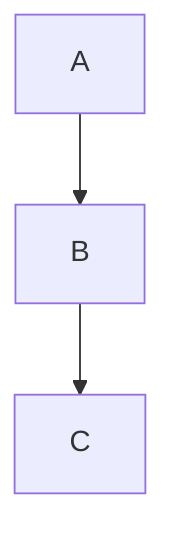
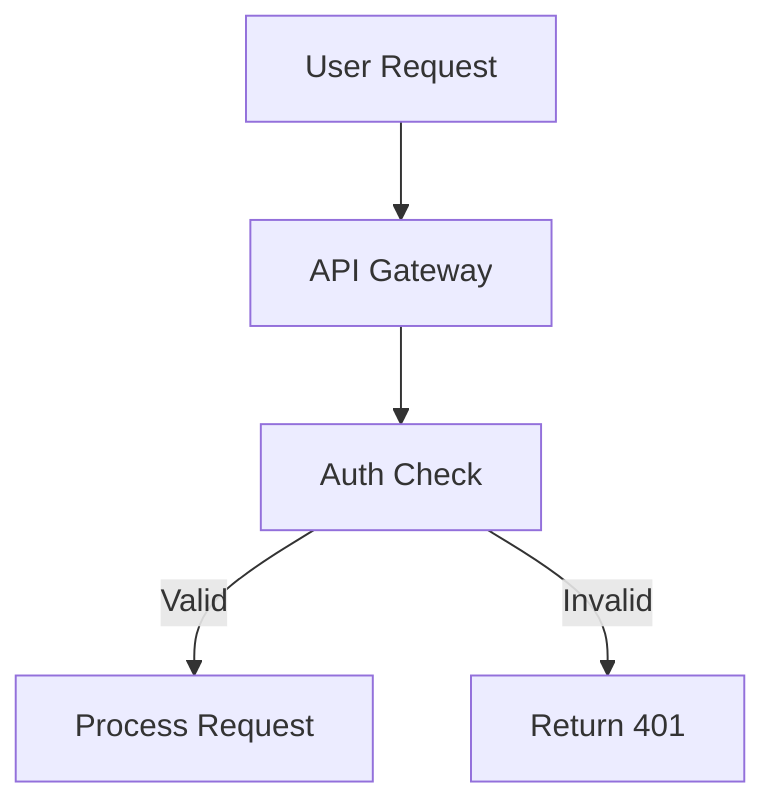

# Best Practices for Project Context

Guidelines for maintaining effective project context documentation.

## Table of Contents
1. [General Principles](#general-principles)
2. [File-Specific Guidelines](#file-specific-guidelines)
3. [Mermaid Diagrams](#mermaid-diagrams)
4. [Update Frequency](#update-frequency)
5. [Common Mistakes](#common-mistakes)

---

## General Principles

### Keep It Concise
- Context files should be scannable, not encyclopedic
- Use bullet points over paragraphs
- Link to detailed docs instead of duplicating

### Keep It Current
- Stale context is worse than no context
- Update after significant changes
- Use timestamps to track freshness

### Keep It Honest
- Document what is, not what should be
- Include known issues and debt
- Note uncertainty when it exists

### Keep It Useful
- Write for someone new to the project
- Include "why" not just "what"
- Make it actionable

---

## File-Specific Guidelines

### brief.md

**Do:**
- Update when project scope changes
- Keep goals measurable
- Clearly define what's out of scope

**Don't:**
- Update for minor changes
- Include implementation details
- Make it a wishlist

**Update frequency:** Rarely (on major pivots)

### architecture.md

**Do:**
- Include Mermaid diagrams for every major flow
- Add step descriptions for each diagram
- Document key decisions with rationale
- Update when adding new components

**Don't:**
- Document every file/function
- Include code snippets (that's what code is for)
- Let it get out of sync with codebase

**Update frequency:** Often (with each architectural change)

### progress.md

**Do:**
- Update at least weekly during active development
- Move items between sections as status changes
- Track blockers with owners
- Note what was completed

**Don't:**
- Include too much historical detail
- Track micro-tasks (that's for issue tracker)
- Forget to update blockers when resolved

**Update frequency:** Frequently (multiple times per week)

### patterns.md

**Do:**
- Document patterns as you establish them
- Include code examples
- Note what didn't work and why
- Add learnings immediately (you'll forget)

**Don't:**
- Document obvious patterns
- Include one-off solutions
- Forget to update when patterns change

**Update frequency:** As needed (when patterns emerge/change)

---

## Mermaid Diagrams

### When to Use Which Type

| Diagram Type | Use For |
|--------------|---------|
| `graph TD` | System architecture, component hierarchy |
| `graph LR` | Pipelines, data flows |
| `sequenceDiagram` | API calls, user interactions |
| `flowchart` | Decision trees, processes |
| `classDiagram` | Data models, relationships |
| `stateDiagram` | State machines, lifecycles |

### Best Practices

1. **Keep diagrams focused** - One concept per diagram
2. **Use clear labels** - Full words, not abbreviations
3. **Group related nodes** - Use subgraphs
4. **Match code structure** - Labels should match actual names

### Always Include Descriptions

Every diagram MUST have:
```markdown
**[Flow Name]:**
1. Step 1: Description
2. Step 2: Description
3. Step 3: Description
```

### Example: Good vs Bad

**Bad:**


**Good:**


**Request Flow:**
1. User sends request to API Gateway
2. Gateway forwards to Auth Check
3. If valid, request is processed; if invalid, 401 returned

---

## Update Frequency

### Recommended Schedule

| File | Trigger | Minimum |
|------|---------|---------|
| brief.md | Scope change | Monthly review |
| architecture.md | New component/flow | Weekly review |
| progress.md | Task completion | 2-3x per week |
| patterns.md | New pattern discovered | As needed |

### Automation Triggers

Consider updating when:
- PR merged to main
- Sprint completed
- Major feature shipped
- Significant bug discovered
- New team member onboards

### Staleness Indicators

| File | Stale If |
|------|----------|
| brief.md | >30 days without review + active development |
| architecture.md | >7 days + code structure changes |
| progress.md | >3 days during active development |
| patterns.md | >14 days + new patterns in code |

---

## Common Mistakes

### 1. Too Much Detail
**Problem:** Context files become unmaintainable
**Solution:** Link to detailed docs, keep context high-level

### 2. Never Updating
**Problem:** Context becomes useless
**Solution:** Build updates into workflow, use `/project-context:update --scan`

### 3. No Diagrams
**Problem:** Architecture is hard to understand
**Solution:** Add Mermaid diagrams for every flow

### 4. Diagrams Without Descriptions
**Problem:** Diagrams are ambiguous
**Solution:** Always add step-by-step descriptions

### 5. Optimistic Progress
**Problem:** progress.md doesn't reflect reality
**Solution:** Be honest about blockers and delays

### 6. Copying CLAUDE.md
**Problem:** Duplication, inconsistency
**Solution:** Reference context files from CLAUDE.md, don't duplicate

### 7. Forgetting Patterns
**Problem:** Team keeps rediscovering solutions
**Solution:** Document patterns immediately, even rough notes

---

## Integration Tips

### With CLAUDE.md
- CLAUDE.md should reference context files
- Don't duplicate content between them
- CLAUDE.md = instructions, context files = state

### With AGENTS.md
- Agents should read context before tasks
- Reference specific files for specific tasks
- Keep agent instructions high-level

### With Version Control
- Commit context files with code changes
- Review context changes in PRs
- Use meaningful commit messages for context updates

---

## Quick Reference

### Update Commands
```bash
# Initialize context
/project-context:init

# Update from conversation
/project-context:update --chat

# Update from code changes
/project-context:update --scan

# Update specific file
/project-context:update architecture

# Validate context
/project-context:validate
```

### Checklist Before Major Work
- [ ] Read brief.md - understand project goals
- [ ] Check progress.md - see current focus and blockers
- [ ] Review architecture.md - understand system design
- [ ] Check patterns.md - follow established patterns
