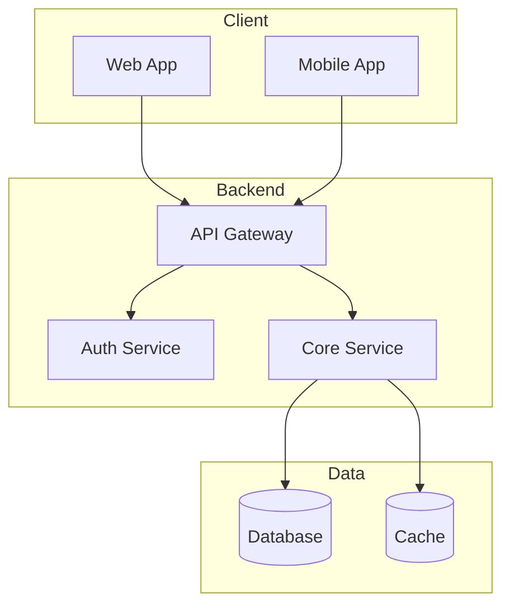
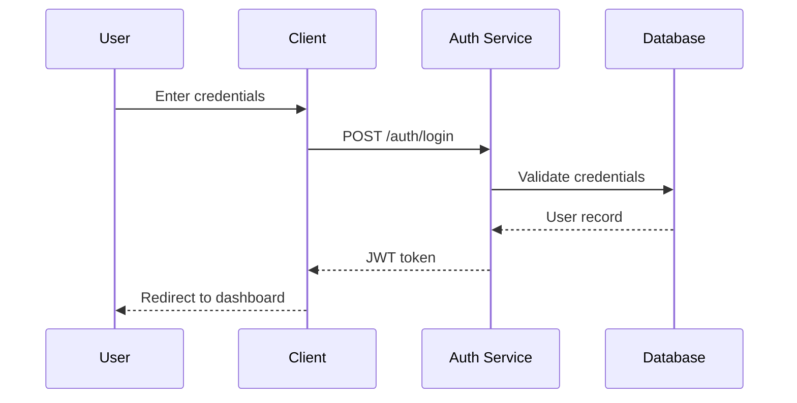
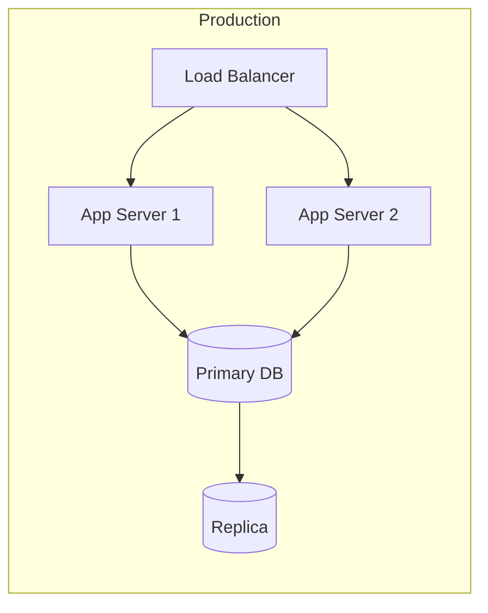

# Context File Templates

Complete templates for each project context file with examples.

## Table of Contents
1. [brief.md Template](#briefmd-template)
2. [architecture.md Template](#architecturemd-template)
3. [progress.md Template](#progressmd-template)
4. [patterns.md Template](#patternsmd-template)

---

## brief.md Template

```markdown
# Project Brief

## Overview

[1-2 paragraph description of what the project is and why it exists]

**Project Name:** [Name]
**Type:** [Web App / Mobile App / CLI Tool / Library / API / etc.]
**Target Users:** [Who uses this]

## Goals

### Primary Goals
1. [Main objective]
2. [Secondary objective]

### Success Metrics
- [ ] [Measurable outcome 1]
- [ ] [Measurable outcome 2]

## Scope

### In Scope
- Feature/capability 1
- Feature/capability 2
- Feature/capability 3

### Out of Scope
- Explicitly not doing X
- Explicitly not doing Y

### Constraints
- Budget: [if applicable]
- Timeline: [if applicable]
- Technical: [any limitations]

## Stakeholders

| Role | Name/Team | Responsibility |
|------|-----------|----------------|
| Owner | | Final decisions |
| Developer | | Implementation |
| User | | Feedback |

## References

- [Link to specs]
- [Link to designs]
- [Link to related docs]

---
*Last updated: YYYY-MM-DD*
```

---

## architecture.md Template

```markdown
# Architecture

## Tech Stack

| Layer | Technology | Purpose |
|-------|------------|---------|
| Frontend | [e.g., React, Vue] | [UI rendering] |
| Backend | [e.g., Node.js, Python] | [API/business logic] |
| Database | [e.g., PostgreSQL, MongoDB] | [Data persistence] |
| Infrastructure | [e.g., AWS, Vercel] | [Hosting/deployment] |

## System Overview



**System Flow:**
1. Clients (Web/Mobile) connect through API Gateway
2. Gateway routes to appropriate service
3. Services process requests and interact with data layer
4. Response flows back through gateway

## Key Flows

### User Authentication Flow



**Steps:**
1. User enters credentials in login form
2. Client sends credentials to Auth Service
3. Auth Service validates against database
4. On success, JWT token returned
5. Client stores token and redirects user

### [Add more flows as needed]

## Component Details

### [Component Name]
- **Purpose:** What it does
- **Location:** `src/path/to/component`
- **Dependencies:** What it relies on
- **API:** Key endpoints or methods

## Key Decisions

| Decision | Options Considered | Choice | Rationale | Date |
|----------|-------------------|--------|-----------|------|
| Database | PostgreSQL, MongoDB, SQLite | PostgreSQL | ACID compliance, complex queries | YYYY-MM-DD |
| Auth | JWT, Sessions, OAuth | JWT | Stateless, scalable | YYYY-MM-DD |

## Infrastructure



---
*Last updated: YYYY-MM-DD*
```

---

## progress.md Template

```markdown
# Progress

## Current Focus

[1-2 sentences about what's being worked on right now]

## Status

- **Phase:** [Planning / Development / Testing / Staging / Production]
- **Sprint/Cycle:** [Sprint 5 / Week 3 / etc.]
- **Health:** [On Track / At Risk / Blocked]
- **Next Milestone:** [Description] - [Date]

## Blockers

| Blocker | Impact | Owner | Status |
|---------|--------|-------|--------|
| [Issue] | [High/Med/Low] | [Who] | [Pending/Resolved] |

*No blockers* (if none)

## Completed

### This Sprint/Week
- [x] Feature/task completed
- [x] Bug fixed
- [x] Documentation updated

### Previous
- [x] Major milestone 1 (Date)
- [x] Major milestone 2 (Date)

## In Progress

- [ ] **[Feature Name]** - [Status: 60%] - [Owner]
  - Sub-task 1 ✓
  - Sub-task 2 (in progress)
  - Sub-task 3

- [ ] **[Feature Name]** - [Status: Started] - [Owner]

## Upcoming

### Next Sprint
- [ ] Feature A
- [ ] Feature B

### Backlog (Prioritized)
1. Feature C
2. Feature D
3. Technical debt item

## Known Issues

| Issue | Severity | Workaround | Planned Fix |
|-------|----------|------------|-------------|
| [Bug] | [Critical/High/Med/Low] | [Temporary solution] | [Sprint X] |

## Metrics

| Metric | Current | Target | Trend |
|--------|---------|--------|-------|
| Test Coverage | 75% | 80% | ↑ |
| Build Time | 3m | <2m | → |
| Open Bugs | 12 | <10 | ↓ |

---
*Last updated: YYYY-MM-DD*
```

---

## patterns.md Template

```markdown
# Patterns & Learnings

## Established Patterns

### Code Patterns

#### [Pattern Name]
**When to use:** [Situation]
**Implementation:**
```[language]
// Example code
```
**Notes:** [Any caveats]

#### Error Handling
**Pattern:** Centralized error handling with typed errors
**Location:** `src/utils/errors.ts`
**Usage:**
```typescript
throw new AppError('NOT_FOUND', 'User not found');
```

### Architecture Patterns

#### [Pattern Name]
**Description:** [What and why]
**Applied in:** [Where in codebase]

#### Repository Pattern
**Description:** Abstract data access behind interfaces
**Applied in:** `src/repositories/`
**Benefit:** Easy to swap data sources, testable

### Process Patterns

#### Code Review
- All PRs require 1 approval
- Use conventional commit messages
- Include tests for new features

#### Deployment
- Feature branches → develop → staging → main
- Automated tests on PR
- Manual approval for production

## Naming Conventions

| Type | Convention | Example |
|------|------------|---------|
| Files | kebab-case | `user-service.ts` |
| Classes | PascalCase | `UserService` |
| Functions | camelCase | `getUserById` |
| Constants | UPPER_SNAKE | `MAX_RETRIES` |
| Database tables | snake_case | `user_sessions` |

## Learnings

### What Worked Well
- [Approach that was successful]
- [Tool that helped productivity]
- [Process that improved quality]

### What Didn't Work
- [Approach that failed] → [What we do instead]
- [Tool that caused issues] → [Alternative chosen]

### Key Insights
- [Important discovery about the domain]
- [Technical insight worth remembering]
- [User behavior insight]

## Anti-Patterns to Avoid

### [Anti-pattern Name]
**Problem:** [What goes wrong]
**Instead:** [What to do]

### God Objects
**Problem:** Classes/modules that do too much
**Instead:** Single responsibility, smaller focused units

## Resources

- [Link to style guide]
- [Link to architecture docs]
- [Link to useful tools]

---
*Last updated: YYYY-MM-DD*
```
