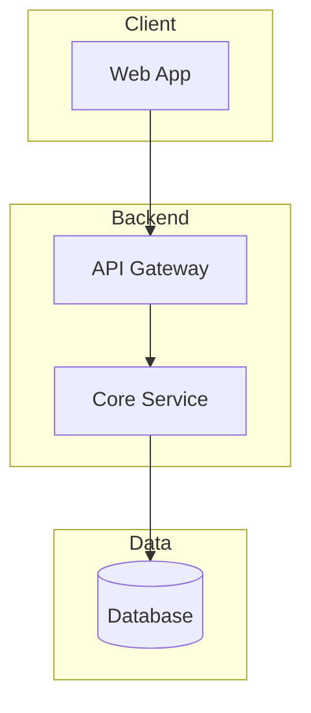

# Context File Templates

Templates for each project context file. Use with `/project-context:init`.

## brief.md

```markdown
# Project Brief

## Overview
[1-2 paragraph description of what the project is and why it exists]

**Project Name:** [Name]
**Type:** [Web App / Mobile App / CLI Tool / Library / API]
**Target Users:** [Who uses this]

## Goals
1. [Primary goal]
2. [Secondary goal]

## Scope

### In Scope
- [Feature/capability]

### Out of Scope
- [Explicitly not doing]

### Constraints
- Timeline: [if applicable]
- Technical: [limitations]

---
*Last updated: YYYY-MM-DD*
```

## architecture.md

```markdown
# Architecture

## Tech Stack

| Layer | Technology | Purpose |
|-------|------------|---------|
| Frontend | [e.g., React] | [UI rendering] |
| Backend | [e.g., Node.js] | [API/business logic] |
| Database | [e.g., PostgreSQL] | [Data persistence] |
| Infrastructure | [e.g., AWS] | [Hosting/deployment] |

## System Overview


```mermaid
graph TB
    subgraph "Client"
        A[Web App]
    end
    subgraph "Backend"
        C[API Gateway]
        E[Core Service]
    end
    subgraph "Data"
        F[(Database)]
    end
    A --> C
    C --> E
    E --> F
```

**Flow:** Client → API Gateway → Service → Database

## Key Decisions

| Decision | Choice | Rationale | Date |
|----------|--------|-----------|------|
| | | | |

---
*Last updated: YYYY-MM-DD*
```

## state.md

```markdown
# State

## Current Position
**Phase:** [Planning / Development / Testing / Production]
**Active Plan:** [plan name or "none"]
**Focus:** [1 sentence: what's being worked on right now]

## Session Info
**Last Session:** YYYY-MM-DD
**Context:** [Brief note about what was happening]

## Blockers
- [None or list active blockers]

## Decisions Pending
- [None or list pending decisions]

## Next Action
[What to do next — used by /project-context:next for routing]

---
*Last updated: YYYY-MM-DD*
```

## progress.md

```markdown
# Progress

## Completed
- [x] [Feature/task] (YYYY-MM-DD)

## In Progress
- [ ] **[Feature]** — [status/percentage]

## Upcoming
- [ ] [Feature]

## Known Issues
| Issue | Severity | Workaround |
|-------|----------|------------|
| | | |

---
*Last updated: YYYY-MM-DD*
```

## patterns.md

```markdown
# Patterns & Learnings

## Code Patterns

### [Pattern Name]
**When:** [Situation]
**Example:**
```[language]
// code example
```
**Notes:** [Caveats]

## Naming Conventions

| Type | Convention | Example |
|------|------------|---------|
| Files | kebab-case | `user-service.ts` |
| Classes | PascalCase | `UserService` |
| Functions | camelCase | `getUserById` |

## Learnings
- [What worked and why]
- [What didn't work and what to do instead]

## Anti-Patterns
- **[Name]**: [Problem] → [Do this instead]

---
*Last updated: YYYY-MM-DD*
```

## dependencies.md

For monorepo subprojects that need to declare relationships with sibling projects.
This file is optional — only needed when a project has cross-project dependencies.

```markdown
# Dependencies

## Upstream (Consumes)

Projects this subproject depends on.

| Project | Path | What | Notes |
|---------|------|------|-------|
| shared | ../shared | Types, validation utilities | Core domain types |
| database | ../database | Schema definitions | Read-only access |

## Downstream (Consumed By)

Projects that depend on this subproject.

| Project | Path | What | Notes |
|---------|------|------|-------|
| web | ../web | REST API endpoints | v2 API |

## Integration Points

Key files/interfaces at dependency boundaries.

### shared → this
- Types: `packages/shared/src/types/api.ts`
- Validators: `packages/shared/src/validators/`

### this → web
- API spec: `docs/openapi.yaml`
- Client SDK: `src/client/`

## Impact Rules

When changing this project, consider:
- **Breaking API changes** → Notify: web
- **Schema changes** → Coordinate with: database
- **Type changes** → Update: shared types first

---
*Last updated: YYYY-MM-DD*
```
